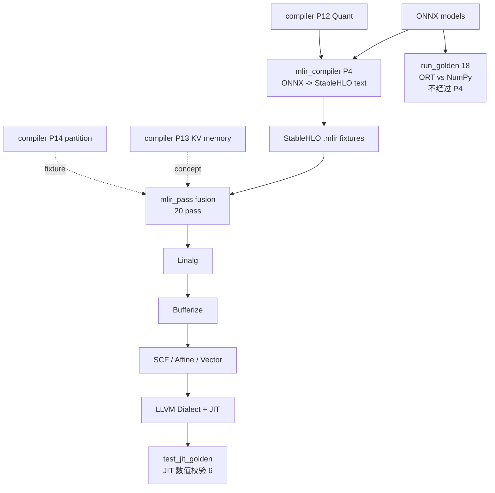

# 两仓库 AI 编译器学习路径与核心代码导读

> **唯一主文档**：本文是两仓库 AI 编译器学习的唯一主文档（旧版速查页与学习导读已并入本文）。  
> **适用读者**：已具备 C++ 基础，希望系统学习 `mlir_compiler` + `mlir_pass` 两个工程，并能把项目讲成一条可信的 AI 编译器学习路线。  
> **边界提醒**：两个工程覆盖的是「教学地图 + 真实 MLIR 局部落地」。没有实现 Conv GPU JIT、真实 FlashAttention kernel、QAT/FP8、NCCL runtime、Dynamo 前端、完整自定义 Dialect 或 LLaMA 全模型 benchmark。

配套文档：

- [`mlir_pass/README.md`](../../../../../../mlir_pass/README.md)：构建、CLI、pipeline、测试 target。
- [`mlir_compiler/README.md`](../../../../README.md)：P1–P14 教学 pipeline。
- [`编译器能力映射.md`](./编译器能力映射.md)：能力边界与工业级缺口。
- [`AI_COMPILER_INTERVIEW.md`](./AI_COMPILER_INTERVIEW.md)：面试题库与概念补充。

---

## 1. 一页速览

### 1.0 一分钟项目故事

> `mlir_compiler` 负责前端：把 ONNX 模型解析并降到 StableHLO（P4 三级 lowering）。**注意：`run_golden` 不验证 lowering 的产物**——它拿 ONNX Runtime 当标准答案，认证测试脚本里那套 NumPy 算子参考实现是对的（这套参考实现之后要在 `test_jit_golden` 里当裁判）；lowering 产出的 StableHLO 本身靠 `run_lowering` 和跨仓库 e2e 看结构（见 [§1.4.1](#141-例子-1run_golden-到底在比什么)）。
>
> `mlir_pass` 负责中后端：接手导出的 StableHLO `.mlir`，在真实 MLIR PassManager 中做 Conv+BN 等 7 个真图变换、Transformer/FFN/GEMM/QDQ/Layout/KV 等 13 个子图标注，再经 Linalg → Bufferize → SCF/Affine/Vector 降到 LLVM Dialect。数值上唯一真正「编译成机器码跑一遍再核对结果」的测试是 `test_jit_golden`（见 [§1.4.2](#142-例子-2test_jit_golden-和-run_golden-差在哪)）。
>
> 10 条跨仓库 e2e 脚本把两仓串成一条可复现的链路。量化、KVCache、图分区在 compiler 侧有教学模拟，pass 侧通过 e2e fixture 桥接；工业级 GPU kernel、NCCL、QAT/FP8 和全模型 benchmark 明确不在项目范围内。

面试时按这三段讲；不要说/推荐说法速查见 [§8 面试表达边界](#8-面试表达边界)。上面提到的 **QDQ** 是全文档最容易被绕晕的概念，两仓库里有 5 条互不相同的代码路径都沾"QDQ"的边，一次性讲清见 [§3.6 QDQ 全景](#36-qdq-全景一次讲清后文不再重复)。上面提到的 **两个名字里都带 "golden" 的测试**（`run_golden` 18 项、`test_jit_golden` 6 项）验的是完全不同的东西——前者不测编译器、只认证 NumPy 参考实现，后者才真正执行编译产物——一次性讲清见 [§1.4 验证方式全景](#14-验证方式全景三种测试各验什么)。

### 1.1 推荐学习顺序

```text
第 0 步  环境搭建 + 冒烟验证（0.5–1 天）→ 确认两仓库能 build、能跑通一条命令
第 1 步  mlir_compiler（2–3 周）        →  建立 AI 编译器地图
第 2 步  mlir_pass（2–3 周）            →  在真实 MLIR 上落地地图
第 3 步  跨仓库 e2e（1 周）             →  讲清 ONNX → StableHLO → fusion → LLVM/JIT 故事
```

**第 0 步不能跳过**：MLIR/StableHLO 依赖较重（需 `/usr/local` 下自编译的 MLIR + 匹配版本 StableHLO），编译不过是自学最常见的劝退点。先按两仓库 README 装好工具链，再各跑一条冒烟命令确认环境 OK，然后才进 P1：

```bash
# mlir_compiler：纯 C++ 阶段无外部依赖，先跑通它证明构建链没问题
cd mlir_compiler && mkdir -p build && cd build && cmake .. && cmake --build . -j
cmake --build . --target run_shlo_opt      # 冒烟：不需要任何可选依赖

# mlir_pass：需要 MLIR/StableHLO（见其 README「环境准备」）
cd ../../mlir_pass
cmake -B build -G Ninja -DCMAKE_PREFIX_PATH=/usr/local -DSTABLEHLO_LIB_DIR=/usr/local/lib
ninja -C build test_shell_regression       # 冒烟：能过说明 pipeline + JIT 链路通
```

冒烟命令能过，再进第 1 步；过不了先解决环境（参考各仓库 README 的依赖表）。

不要反过来学。`mlir_pass` 的输入已经是 StableHLO `.mlir`，如果没有先理解 `mlir_compiler` 的 P4 lowering、参考实现校验（`run_golden`）和 ONNX fixture，很难判断 pass 在优化什么。

### 1.2 当前工程指标

> 下列数字均**从代码/脚本直接核对得出**（不是人工维护的二手表）；如与实际构建产物不符，以代码为准。核对方法见「来源」列，可自行复算。

| 指标 | 当前值 | 来源（核对位置 / 复算方法） |
|------|--------|------------------------------|
| `mlir_pass` teaching pass | **28**（fusion 20 + 中后端 8） | `lib/Transforms/RegisterPasses.cpp` 的 `registerAICompilerPasses`（20 fusion + 8 `custom-*`）；fusion 顺序见 `lib/Pipeline/PipelineStages.cpp` 的 `buildFusionStage` |
| Shell / LIT | **36 / 39** | `scripts/test_shell_regression.sh` 里 `== … ==` 场景数 = 36；`test/CMakeLists.txt` 拷贝的 `test/lit/*.mlir` = 39 |
| Golden 测试项 | `run_golden` **18** + `test_jit_golden` **6** | `run_lowering_golden.py` 的 `CHECKS`（17）+ `--quant-dir` 的 1 项 = 18；`scripts/run_jit_golden.py` 的 `CASES` = 6；两者验证对象完全不同，见 [§1.4](#14-验证方式全景三种测试各验什么) |
| Transformer e2e fixture | **11** | `scripts/run_transformer_e2e.sh` 里 `run_case` 调用数 = 11 |
| 跨仓库 e2e 脚本 | **10** | `test/CMakeLists.txt` 里 `test_*_e2e` / `_smoke` / `_golden` 的 target 数 = 10（`_golden` 只是 CMake 命名，指 `test_jit_golden`，见 §1.4） |

### 1.3 两仓库分工

| 仓库 | 角色 | 重点学习内容 | 实现形态 |
|------|------|--------------|----------|
| `mlir_compiler` | AI 编译器教学地图 | ONNX 前端、StableHLO lowering、参考实现校验、量化、内存、图分区 | P1–P4 偏真实（Protobuf + StableHLO 文本）；P5–P14 为 C++ header-only 教学 IR |
| `mlir_pass` | 真实 MLIR 落地 | PassManager、PatternRewrite、StableHLO→Linalg→Bufferize→SCF/Affine/Vector→LLVM/JIT | 真实 MLIR C++ API + `mlir-opt` plugin + LIT/Shell/e2e |



### 1.4 验证方式全景：三种测试各验什么

> 代码里历史原因多处叫 "golden"（`run_golden`、`test_jit_golden`、`comm golden`），但其实是 **3 件互不相干的事**。本文档给它们起了三个直白的中文名——**参考实现校验**、**JIT 数值校验**、**输出快照检查**——后文统一用这三个名字，写命令时保留原始 target 名。

先解释一个贯穿本节的概念：**NumPy 参考实现**。项目为每个算子（softmax、attention、rmsnorm……）都写了一份 NumPy 版的实现（如 `_softmax` 函数），充当该算子数学语义的「可运行规格说明」。它不是编译器的一部分，只存在于测试脚本里。

#### 1.4.0 先用人话讲三件事（不看表也能懂）

| 中文名 | 测试 | 一句话 | 比的是什么 |
|--------|------|--------|------------|
| **参考实现校验** | `run_golden`(脚本 `run_lowering_golden.py`) | **给 NumPy 参考实现发合格证**：同一个 `.onnx`，ORT 和 NumPy 参考实现各算一遍，看是否一致 | ONNX Runtime 的输出 **vs** NumPy 参考实现的输出 |
| **JIT 数值校验** | `test_jit_golden` | **考编译器**：把 `.mlir` 编译成机器码跑一遍，看算出来的数对不对 | LLVM JIT 打印的数组 **vs** NumPy 参考实现的输出 |
| **输出快照检查** | `test_partition_smoke`(P14 comm bytes) | **跑一遍图分区 demo，看打印出来的通信字节数有没有变** | 程序打印的 `262144` **vs** 脚本里写死的 `262144` |

**`run_golden` 存在的意义（为什么要做 ORT vs NumPy 这个比较）**：它测的既不是 `.onnx` 文件、也不是编译器，而是**认证那 18 份 NumPy 参考实现本身是对的**。链条是这样的：

1. 写 C++ lowering（比如把 Softmax 拆成 `max→sub→exp→div`）依据的是开发者对算子数学的理解；
2. 这份理解同时被写成了 NumPy 参考实现——但**万一理解本身就错了**（比如归一化轴搞错），lowering 和 NumPy 实现会一起错，互相对不出问题；
3. 所以拉 ONNX Runtime（ONNX 官方语义的事实标准）当**裁判**：NumPy 参考实现和 ORT 算得一致 → 证明项目对算子的理解 = ONNX 官方语义；
4. 通过认证的 NumPy 参考实现，之后才有资格在 `test_jit_golden` 里**当裁判**去批改编译器的 JIT 结果——如果参考实现本身是错的，JIT 测试就成了「用错误答案批改卷子」。

一句话：**`run_golden` 是「先认证裁判，再让裁判上岗」里的认证环节**；`.onnx` fixture 在这里只是考题载体（顺带验证 fixture 能被 ORT 正常加载运行）。

**关键：`run_golden` 从来不碰 lowering 产出的 StableHLO。** 它只读 `.onnx`，用 ORT 和 NumPy 参考实现各算一遍。名字叫 `run_lowering_golden` 是因为：它测的是 **P4 lowering 教学用的那批 ONNX fixture**（`lowering_models/` 目录），不是因为它会跑 lowering 程序。CMake target 叫 `run_golden`，文件叫 `run_lowering_golden.py`——都是历史命名，容易误导，记住「认证参考实现、不比 IR」就行。

---

#### 1.4.1 例子 1：`run_golden` 到底在比什么？

以 `check_softmax` 为例（`run_lowering_golden.py` 第 67–74 行），每一步都很具体：

**输入**：`lowering_models/lowering_softmax.onnx`（一个只有 Softmax 的小 ONNX 图）

**测试自己构造的输入张量**：

```python
x = [[1.0, 2.0, 3.0, 4.0],
     [0.5, 1.5, 2.5, 3.5]]   # shape [2, 4]
```

**路径 A — ONNX Runtime**（当作「ONNX 官方实现对这张图怎么算」）：

```python
out_ort = InferenceSession("lowering_softmax.onnx").run(None, {"X": x})["Y"]
```

**路径 B — NumPy 参考实现**（项目对 Softmax 数学语义的「可运行规格说明」）：

```python
def _softmax(x):
    x = x - np.max(x, axis=-1, keepdims=True)   # 减最大值防溢出
    e = np.exp(x)
    return e / np.sum(e, axis=-1, keepdims=True)

expected = _softmax(x)
```

**比较**：

```python
np.allclose(out_ort, expected)   # 两边数组逐元素接近 → PASS
```

所以 **`run_golden` 比的是：ORT 跑 `.onnx` 的结果 vs NumPy 参考实现的结果**——比的是两个纯浮点数组，不涉及 IR、图结构或任何编译器产物。全程没有：

- 调用 `run_lowering_l1/l2/l3`
- 读取或执行任何 `.mlir` / StableHLO

**那它和 lowering 有什么关系？** 间接关系：P4 的 C++ lowering 代码（比如 `convert_softmax`）里的拆解方案，和 `_softmax` 参考实现依据的是同一份数学理解。参考实现通过了 ORT 认证 → 说明这份理解没错 → 按同一份理解写的 lowering 在公式层面大概率也对。但如果 C++ 实现时**手滑**（比如维度写错、还能打出合法 IR），`run_golden` **发现不了**，因为它压根没跑那段 C++。

其他 17 个 `check_*` 完全同一个模式：读 `.onnx` → ORT 算一遍 → NumPy 参考实现算一遍 → `allclose`。第 18 项是 `--quant-dir` 时多跑 `quant_qdq_matmul.onnx` 的 quant/dequant 数值。

---

#### 1.4.2 例子 2：`test_jit_golden` 和 `run_golden` 差在哪？

还是「两边各算一遍再 `allclose`」，但**被测的对象完全相反**：

| | `run_golden` | `test_jit_golden` |
|---|---|---|
| 输入 | `.onnx` | `.mlir`（如 `test/matmul_add.mlir`） |
| **被测的一方** | NumPy 参考实现（项目对算子数学的理解对不对） | JIT 执行结果（编译器整条链有没有把数算错） |
| **当标准答案的一方** | ONNX Runtime（业界权威实现） | NumPy 参考实现（已通过 ORT 认证，此时是可信裁判） |
| 执行了什么 | 只跑了 ORT，没碰任何编译产物 | StableHLO → fusion → Linalg → Bufferize → loops → LLVM → JIT |

注意这个反转：**NumPy 参考实现在 `run_golden` 里是被考的学生（拿 ORT 当老师），在 `test_jit_golden` 里是老师（拿它去考编译器）。这正是 `run_golden` 存在的意义——先认证裁判，再让裁判上岗。**

> 严格说，`test_jit_golden` 用的 `ref_*` 函数写在 `mlir_pass/scripts/run_jit_golden.py` 里，是**独立的一份拷贝**，不是 import 自 `run_lowering_golden.py`——两边共享的是同一套数学写法，不是同一段代码。「认证裁判」认证的是这套数学，不是那几行具体代码。

`test_jit_golden` 从 stdout 里抓 `JIT result (4 elements): 1.5, 2.5, ...` 这行，再和 NumPy 参考实现的结果对比。这是全仓库**唯一**真正执行「编译出来的代码」并核对数值的地方。

---

#### 1.4.3 例子 3：P14「通信字节数 262144」是什么？

这不是数值计算测试，**根本不比两个算子结果**。

**P14 在干什么**：`run_graph_partition`（`14_graph_partition/`）是一个教学 demo，把一层 Transformer **切成两块**：

```text
[Attention 分区]  attn_qk → softmax → attn_av → residual1
                         ↓
              boundary tensor: hidden1   ← 两块之间的「交接张量」
                         ↓
[FFN 分区]        ln1 → ffn_up → gelu → ffn_down → residual2
```

demo 会估算：如果把这两块放到不同设备上，**boundary 张量要传多少字节**。对教学用的固定 shape：

```text
hidden1 的 shape = [1, 8, 4096]，dtype = float32
每个元素 4 字节
hidden1 大小 = 1 × 8 × 4096 × 4 = 131,072 字节

Attention 分区统计一次 boundary → +131072
FFN 分区也统计一次同一条 boundary → +131072
合计打印：Total cross-partition comm bytes: 262144
```

**测试在干什么**（`sync_partition_fixture.py`）：

1. 运行 `./run_graph_partition`
2. 从 stdout 用正则抓 `Total cross-partition comm bytes: (\d+)`
3. 断言这个数 **必须等于 262144**

如果谁改了 tensor shape、分区逻辑、boundary 识别代码，打印出来的数变了，测试就挂——**不是算错了，是「教学 demo 的预期输出变了」**。所以叫「输出快照检查」：把某次正确运行的打印结果（262144）拍成快照存进脚本，之后只检查输出还等不等于这个快照，和前两种「比两个实现算出来的结果」不是一回事。

```bash
cd mlir_pass/build && ninja test_partition_smoke   # 就是跑上面这个检查
```

---

#### 1.4.4 三种验证对照表

| | ① 参考实现校验 `run_golden` | ② JIT 数值校验 `test_jit_golden` | ③ 输出快照检查（P14） |
|---|---|---|---|
| **比什么** | ORT 输出 **vs** NumPy 参考实现 | JIT 输出 **vs** NumPy 参考实现 | 程序打印的字节数 **vs** 写死的 262144 |
| **输入文件** | `.onnx` | `.mlir` | 无文件输入，直接跑 demo 二进制 |
| **执行生成代码？** | 否 | 是（唯一） | 否（只看打印行） |
| **数量** | 18 项 | 6 项 | 1 个数字 |
| **和 lowering 的关系** | 测 lowering 用的 fixture，但不跑 lowering | 测 mlir_pass 整条编译链 | 无关 |

> **别和 JIT 冒烟搞混**：`test_shell_regression.sh` 里 `== JIT smoke ==` 只跑一次 `--jit` 后 `grep '1.5'`，确认路径没崩，**不做** `np.allclose`，也不在 `test_jit_golden` 的 6 项里。

#### 1.4.5 数据流总览

```text
【run_golden — 同一个 .onnx，两种算法各算一遍】
  lowering_softmax.onnx + 输入 x
       ├─► ONNX Runtime ──► out_ort ──┐
       └─► NumPy _softmax(x) ──► expected ──┤── np.allclose → PASS/FAIL
                                            ┘
  （不调用 run_lowering，不读 .mlir）

【test_jit_golden — 编译 .mlir 再执行】
  matmul_add.mlir ──► pipe-demo --jit ──► JIT result: [1.5, 2.5, ...]
                                              └── 和 NumPy 参考实现 allclose

【P14 — 只看打印的一个数】
  run_graph_partition ──► stdout 里 "Total cross-partition comm bytes: 262144"
                              └── 必须等于脚本里写死的 262144
```

P4 还有第三条独立链路（和上面两种数值测试都不同）：

```text
run_lowering_l*：  .onnx ──► C++ lowering ──► 打印 StableHLO（看 IR 结构，不比数值）
跨仓库 e2e：       .onnx ──► lowering ──► pipe-demo ──► grep 断言 attribute（看 IR，不比数值）
```

#### 1.4.6 命令速查

```bash
# ① 参考实现校验（compiler，18 项）— ORT 认证 NumPy 参考实现，不跑 lowering
cd mlir_compiler/build
cmake --build . --target gen_lowering_models gen_quant_models run_golden

# ② JIT 数值校验（pass，6 项）— 编译执行 .mlir 再和 NumPy 比
cd mlir_pass/build
ninja test_jit_golden

# ③ P14 通信字节（pass，1 个数）— 打印值必须还是 262144
ninja test_partition_smoke
```

#### 1.4.7 一句话记忆（面试可直接背）

> `run_golden`（参考实现校验）：同一个 `.onnx`，ORT 算一遍、NumPy 参考实现算一遍，看是否一致——考的是**NumPy 参考实现**（先认证裁判），不执行 lowering 产物。`test_jit_golden`（JIT 数值校验）：`.mlir` 编译成机器码跑一遍，和已认证的 NumPy 参考实现比——考的是**编译器整条链**（裁判上岗）。P14 的 262144（输出快照检查）：图分区 demo 打印的通信字节数，脚本断言它和存好的快照一致——**不比计算结果，只看输出变没变**。

---

## 2. 标准学习路线

### 2.1 三种路线

三条路线共用同一份知识地图，区别只在**覆盖广度和是否动手改代码**。下面 §2.2/§2.3 是**标准路线**的展开；速成、深度各自的可执行清单见 §2.4。

| 路线 | 总时长 | 每日投入 | 目标 | 展开在哪 |
|------|--------|----------|------|----------|
| 速成 | 2 周 | 3–4 h | 能讲清两仓库分工、跑通 e2e、精读 2 个 pass | §2.4 速成清单 |
| 标准 | 5 周（可压到 4、拉到 6） | 2 h | 能独立 trace 一条 ONNX → StableHLO → MLIR → JIT 链路 | §2.2 + §2.3 |
| 深度 | 8–10 周 | 2–3 h | 能新增一个 ONNX pattern、一个 MLIR pass、一个 LIT/e2e fixture | §2.4 深度清单 + §10 |

> 时长口径统一：标准路线 = §2.2 的 **5 周计划**（自学快可压到 4 周、慢可拉到 6 周），不再出现"4–6 周 / 5 周"两种说法。

### 2.2 5 周标准计划

| 周 | 主仓库 | 主题 | 核心产出 |
|----|--------|------|----------|
| 1 | `mlir_compiler` | P1–P3 ONNX 前端 + 图优化 | 能画 ONNX GraphProto → mini IR → graph rewrite |
| 2 | `mlir_compiler` | P4 ONNX→StableHLO + 参考实现校验 | 能读 `ConversionPattern`，`run_golden` 18/18 |
| 3 | `mlir_pass` | fusion stage + PatternRewrite | 能解释 20 个 fusion pass 顺序 + 真变换/标注之分，跑通 `test_transformer_e2e` |
| 4 | `mlir_pass` | Linalg → Bufferize → SCF/Affine/Vector → LLVM/JIT | 能对比四条 `--loop-mode`，跑通 JIT 数值校验 |
| 5 | 双仓库 | 量化、布局、KVCache、图分区、CI | 全量 target PASS，能讲面试故事和项目边界 |

### 2.3 每日安排

| 周 | 一 | 二 | 三 | 四 | 五 | 六/日 |
|----|----|----|----|----|----|-------|
| 1 | README + INTERVIEW §1 | `mini_ir.h` | P1 parse | P2 mini IR | P3 graph rewrite | 手绘 pipeline |
| 2 | §3.2 tier 1/2/3 区别 | `run_level1` 手写 lowering | `run_level2` broadcast/dynamic | `run_level3` + framework | 参考实现校验 | 导出 2 个 `.mlir` |
| 3 | `PipelineStages.cpp` | `ConvBNFusion.cpp` | `SoftmaxLegalize.cpp` | transformer e2e | quant/layout e2e | INTERVIEW §14 |
| 4 | bufferize | linalg | SCF | affine | vector | JIT 数值校验 |
| 5 | P12 quant | P13 KV | P14 partition | plugin | 全量验证 | 对照能力映射自讲 |

### 2.4 速成 / 深度的可执行清单

**速成（2 周）——只走主干，跳过所有教学模拟与补课**

按顺序完成这几件事即可达成"能讲故事 + 跑通 e2e + 读懂 2 个 pass"：

1. 第 0 步环境冒烟（§1.1）→ 跑通 `run_shlo_opt` 和 `test_shell_regression`。
2. 只读 **§3.2（P4 ONNX→StableHLO）** 和 **§4.1（Pipeline 总控）**，建立"图从哪来、pass 怎么编排"的骨架。
3. 精读 **2 个 pass**：`ConvBNFusion.cpp`（真变换）+ `SoftmaxLegalize.cpp`（标注），配合 §4.4 的真变换/标注二分表。
4. 跑通 **1 条 e2e + JIT 数值校验**：`ninja test_transformer_e2e test_jit_golden`。
5. 背熟 **§8 面试边界** 和一分钟故事。

> 速成可**跳过**：§3.3–§3.5（P12/P13/P14 教学模拟）、§4.5 中后端细节、§6 全部补课点。这些标了「可选/深挖」。**唯一例外是 §3.6（QDQ 全景）**——只有 10 分钟阅读量，但能一次性避免被 QDQ 相关内容绕晕，建议速成也读。

**深度（8–10 周）——在标准路线之上动手改代码**

先完成标准 5 周计划，再从 §10「建议深挖任务」里挑 2–3 个真正落地（每个都要有验收产物）：

1. 新增一个 ONNX op pattern（改 `mlir_compiler` P4）→ `run_golden` 多一项通过（给新 pattern 配一份 NumPy 参考实现）。
2. 新增一个标注 pass 或把一个标注 pass 升级成真变换（改 `mlir_pass`）→ 配 LIT `CHECK` / `CHECK-NOT`。
3. 新增一条跨仓库 e2e（CMake target + 脚本）→ 纳入 §7.2 全量验证。
4. 通读 **§6 全部补课点**，每个补课点对照 §8 写出"我知道工业怎么做、当前项目边界在哪"。

---

## 3. `mlir_compiler`：先建立 AI 编译器地图

> **核心 / 可选标记**：§3.1（P1–P3）、§3.2（P4）是**核心主干**，所有路线都要读；§3.3–§3.5（P12/P13/P14）是**教学模拟**，速成可跳过、标准第 5 周再看、深度必读；**§3.6（QDQ 全景）篇幅短但所有路线都建议读**，一次性讲清全文档最容易绕晕的 QDQ 概念。
>
> **P5–P10 去哪了？** compiler 侧的 P5–P10（StableHLO 优化 / Linalg / Bufferize / SCF / Vector / LLVM）是 header-only **教学 IR**，只用于建立概念地图；它们的**真实 MLIR 实现在 `mlir_pass` §4**，因此本节不展开 compiler 侧的 P5–P10，直接去 §4 看真家伙。

### 3.0 关键架构前提：`mlir_compiler` 不用 MLIR C++ API

> **这是最容易被误解的地方，先读这一节再看代码。**

`mlir_compiler` 的每个 P 阶段**各自维护一套自定义 C++ 结构体 IR**，**不共享**、也**不流向下一个 P**。整个仓库**全部是纯 C++17 header-only 自定义 IR**，**不链接 MLIR / StableHLO 运行库**。真正基于 MLIR C++ API 的 StableHLO Pass（Conv+BN Fusion 等 `mlir-opt` 插件）都在 [`mlir_pass`](../../../../mlir_pass/) 仓库里（`lib/Transforms/` + `tools/mlir-opt-plugin/`）。

**各阶段 IR 一览：**

| 阶段 | IR 头文件 | 类型 | 备注 |
|------|-----------|------|------|
| P1–P3 | `common/mini_ir.h`，`namespace mini_ir` | **自定义** | ONNX GraphProto → mini_ir::Graph，做前端图优化 |
| P4 | `4_onnx_to_stablehlo/stablehlo_ir.h`，`namespace shlo` | **自定义 write-once 发射器** | 有 SSA 名和类型，但 **无 use-def 链**（operand 存为 `Op::assembly` 字符串）；只支持 `Builder::emit_*` 追加 + 打印 MLIR 文本，**不能**做图改写 |
| P5 | `5_stablehlo_opt/shlo_graph.h`，`namespace shlo_graph` | **自定义可变图 IR** | **有完整 use-def 链**（`Value::defining_op` / `users`、`replace_all_uses`、`erase_op`）；可写 CSE/DCE/融合等 pass，但仍是教学模拟，**不是** mlir-opt，也**不接** P4 产物 |
| P6 | `6_linalg_opt/linalg_ir.h` | **自定义** | Linalg 融合概念模拟 |
| P7 | `7_bufferize/bufferize_ir.h` | **自定义** | Bufferize 概念模拟 |
| P8 | `8_scf_affine/scf_affine_ir.h` | **自定义** | SCF/Affine 循环模拟 |
| P9 | `9_vector/vector_ir.h` | **自定义** | 向量化模拟 |
| P10 | `10_llvm_lowering/llvm_lowering_ir.h` | **自定义** | LLVM lowering 模拟 |
| P11 | `11_gpu_codegen/gpu_codegen_ir.h` | **自定义** | GPU 映射 / PTX 概念模拟 |
| P12 | `12_quantization/quant_ir.h`，`namespace quant_ir` | **自定义** | 量化流程模拟，见下 |
| P13 | `13_memory_planning/memory_ir.h` | **自定义** | KV/内存规划模拟 |
| P14 | `14_graph_partition/graph_partition_ir.h` | **自定义** | 图切分模拟 |

**各阶段真实输入/输出一览（最重要的表）：**

| 阶段 | 可执行文件 | 真实输入来源 | 真实输出 | 输出去哪 |
|------|-----------|-------------|---------|---------|
| P1 | `run_onnx_parse` | `.onnx` 文件（`argv[1]`） | stdout（打印 GraphProto 结构） | **终点，无下游** |
| P2 | `run_onnx_to_ir` | `.onnx` 文件（`argv[1]`） | stdout（打印 `mini_ir::Graph`） | **终点，无下游** |
| P3 | `run_graph_rewrite` | `.onnx` 文件（`argv[1]`） | stdout（打印优化后 `mini_ir::Graph`） | **终点，无下游** |
| P4 | `run_lowering_l1/l2/l3` | `.onnx` 文件（`argv[1]`） | **标准 StableHLO MLIR 文本**（生成方式是自定义 `shlo::Builder`，但格式与 `mlir-opt` 直接输出的一致）；`--mlir-only` 只输出纯 MLIR 文本、省略调试信息 | e2e 脚本：`L3 --mlir-only onnx > fixture.mlir`，然后 `mlir_pass pipe-demo --input=fixture.mlir` 跑完整 MLIR pipeline |
| P5 | `run_stablehlo_opt` | **内置硬编码测试图**（`main()` 无参数） | stdout（优化过程 + `shlo_graph` 打印） | **终点，无下游** |
| P6 | `run_linalg_opt` | **内置硬编码测试图**（`make_test_graph()`） | stdout（Linalg fusion 过程打印） | **终点，无下游** |
| P7 | `run_bufferize` | **内置硬编码测试图**（`make_test_graph()`） | stdout（Bufferization 过程打印） | **终点，无下游** |
| P8 | `run_scf_affine` | **内置硬编码测试图** | stdout（SCF/Affine 循环打印） | **终点，无下游** |
| P9 | `run_vector` | **内置硬编码测试图**（注释说"来自 P8 概念"） | stdout（Vector dialect 打印） | **终点，无下游** |
| P10 | `run_llvm_lowering` | **内置硬编码测试图**（注释说"来自 P9 概念"） | stdout（LLVM IR + 汇编文本） | **终点，无下游** |
| P11 | `run_gpu_codegen` | **内置硬编码测试图** | stdout（GPU dialect / PTX 概念打印） | **终点，无下游** |
| P12 | `run_quantization` | 默认：**硬编码**（`stage0_setup()`）；`--onnx <file>` 时读 QDQ `.onnx` | stdout（`quant_ir::Graph` 量化过程打印） | **终点，无下游** |
| P13 | `run_memory_planning` | **内置硬编码测试图** | stdout（内存规划打印） | **终点，无下游** |
| P14 | `run_graph_partition` | **内置硬编码测试图** | stdout（图切分打印） | **终点，无下游** |

**三条关键结论：**

1. **只有 P4 的输出是真正有下游消费者的**：P4 用自定义 `shlo::Builder` 生成**标准 StableHLO MLIR 文本**（格式与 `mlir-opt` 一致，`mlir-opt` 可直接解析），`--mlir-only` 把纯文本重定向到 `.mlir` 文件，然后 e2e 脚本把这个文件传给 `mlir_pass` 的 `pipe-demo`，后者用真实 MLIR PassManager 跑完整 pipeline（fusion → Linalg → Bufferize → SCF/Affine/Vector → LLVM → JIT 数值校验）。P5–P14 全部是独立 demo，打印 stdout 后结束，没有任何 P 会消费它们的输出。

2. **P5–P14 的"输入"不来自上一个 P，而是各自硬编码了一张测试图**。它们不构成流水线，每个都是独立教学 demo——P6 的 linalg 图、P7 的 bufferize 图、P9 的 vector 图各自手工构造，互不依赖。

3. **P4 的 `shlo::` 与 P5 的 `shlo_graph::` 是两套不同的 IR，名字相近但能力相反——最容易混。** 见下表。

**P4 `shlo::` vs P5 `shlo_graph::` 对照（必读）：**

| 维度 | P4 `shlo::`（`stablehlo_ir.h`） | P5 `shlo_graph::`（`shlo_graph.h`） |
|------|----------------------------------|-------------------------------------|
| **教学目标** | ONNX → StableHLO **语义 lowering**（`convert_add` / `convert_matmul` / `convert_conv`） | StableHLO 上 **图优化 pass**（CSE / DCE / Conv+BN 融合） |
| **典型操作** | 遍历 ONNX 节点 → `builder.emit_*()` **单向追加** | 在已有图上 **pattern match → `replace_all_uses` / `erase_op`** |
| **Value 结构** | 只有 `name` + `type`，**无** `defining_op` / `users` | 有 `defining_op` + `users`，**完整 use-def 链** |
| **Op 结构** | operand 关系存为 **`Op::assembly` 预格式化字符串** | operand 存为 **`Value*` 指针**，可反向遍历 |
| **能否写优化 pass** | **不能**（无法从 `%3` 反查谁在用、无法 replaceOp） | **能**（教学级：`pass_cse`、`pass_conv_bn_fusion` 等） |
| **输入来源** | `.onnx` 文件 | `main()` 里 `make_test_*()` **硬编码**测试图 |
| **输出** | 标准 StableHLO **`.mlir` 文本** → 给 `mlir_pass` | stdout 打印，**终点** |
| **与 P4 是否串联** | — | **否**（P5 不读 P4 的 `.mlir`，也不共享 IR） |
| **为何不用对方** | lowering 只需 append-only 发射器，用可变图反而增加负担 | 优化 pass 需要 use-def；P4 的 write-once IR 做不了 CSE/融合 |

**P4 为什么不用 `shlo_graph`？** 不是做不到，而是 **职责分离**：P4 教的是「ONNX op 在 StableHLO 里长什么样」（属性、layout、broadcast），Lowering 在工业界也是 **单向 emit**（类似 `OpBuilder`），不需要在 lowering 过程中维护 use-def 或做图改写。P5 专门用 `shlo_graph` 教「有了图之后怎么写优化 pass」。真实 MLIR 上这两步分别由 **P4 的 `.mlir` 输出 + `mlir_pass` 的 PassManager** 完成。

**和真实 MLIR 的关系：**

| IR | use-def | 能写 pass | 产出/消费 |
|----|---------|-----------|-----------|
| P4 `shlo::` | 无 | 否（write-once 文本生成器） | 产出 `.mlir` |
| P5 `shlo_graph::` | 有 | 是（教学级） | 不接 P4，stdout 演示 |
| `mlir_pass` 真实 MLIR | 有 | 是（`ConvBNFusion.cpp` 等） | 消费 P4 的 `.mlir` |

**P4 的 `shlo::ModuleOp` 为什么不是真实 MLIR IR？** 它虽有 C++ 结构体，但 operand 以字符串存在 `Op::assembly` 里，不是 `mlir::Value` use-def 链——**这是 P4 发射器的设计选择**，与 P5 的 `shlo_graph`（有 use-def）无关。P4 的定位是「生成语法正确的 MLIR 文本」，不是「做 IR 变换」。

> **关于 QDQ**：`mlir_compiler`/`mlir_pass` 里凡是带 Q/DQ（Quantize/Dequantize）字样的文件、fixture、pass，**全部**放在一起讲，见 **[§3.6 QDQ 全景](#36-qdq-全景一次讲清后文不再重复)**——本节及后面 §3.2/§3.3/§4.4/§5.2 提到 QDQ 时只给一句结论并指回 §3.6，不再分散重复解释。

### 3.1 P1–P3：ONNX 前端与图优化

学习目标：理解模型前端不是直接进入 MLIR，而是先把 ONNX GraphProto 解析成工程内部可操作的图结构，再做前端图优化。

| 文件 | 应读重点 |
|------|----------|
| `src/mlir/gpu/common/mini_ir.h` | `Graph`、`Op`、`Tensor` 的教学 IR 结构 |
| `1_onnx_parse/run_onnx_parse.cpp` | Protobuf 读取 GraphProto、NodeProto、TensorProto |
| `2_onnx_to_ir/run_onnx_to_ir.cpp` | ONNX op 到 mini IR 的第一层 lowering |
| `3_graph_optimize/run_graph_rewrite.cpp` | Conv+BN fusion、常量折叠、图级 rewrite |
| `common/gen_test_models.py` | 小 ONNX fixture 的来源 |

验证（`run_graph` 是 **P1–P3 的一键链路**：按 `run_onnx_parse` → `run_onnx_to_ir` → `run_graph_rewrite` 顺序依次跑，编排见 `common/run_graph.cmake.in`。**别和 P14 的 `run_graph_partition_demo` 混淆**——那是图切分，见 §3.5）：

```bash
cd mlir_compiler/build
cmake --build . --target run_graph          # P1→P2→P3 全链路
# 也可单跑某一步：
cmake --build . --target run_onnx_parse run_onnx_to_ir run_graph_rewrite
```

核心理解：

- P1 解决「模型怎么进来」。
- P2 解决「外部 ONNX op 如何转成内部 IR」。
- P3 解决「还没进 StableHLO 前，可以做哪些图优化」。
- 这三步是面试里讲 ONNX frontend 的起点，不要说成 Dynamo/FX。

### 3.2 P4：ONNX → StableHLO

P4 是两个工程的连接点。`mlir_compiler` 把 ONNX fixture 降到 StableHLO 文本，`mlir_pass` 消费这些 `.mlir`。

> **命名提醒**：P4 的 **tier 1/2/3** 是 ONNX→StableHLO **内部难度分级**，不是编译器统一分层里的 L1/L2/L3（StableHLO 层 = 编译器 L2）。面试时说「P4 三级 tier」，避免和 MLIR 的 Linalg/Bufferize 阶段混淆。

本节顺序：**3.2.1** 三级 tier 总览 → **3.2.2** 怎么跑（ONNX 生成 + 执行顺序）→ **3.2.3** 精髓：手写一条 lowering（Add/MatMul/Conv）→ **3.2.4** 面试问答 → **3.2.5** 实现细节（选读）→ **3.2.6** 验证与自测。

#### 3.2.1 三级 tier 总览

三者目标都是生成 **StableHLO 文本 IR**，但实现方式和能力范围递进：

| | Tier 1 | Tier 2 | Tier 3 |
|---|--------|--------|--------|
| **定位** | 入门：手写 lowering | 合格：处理真实图细节 | 进阶：通用 conversion 框架 |
| **可执行文件** | `run_lowering_l1` | `run_lowering_l2` | `run_lowering_l3` |
| **源码** | `run_level1.cpp` | `run_level2.cpp` | `run_level3.cpp` + `conversion_framework.h` |
| **架构** | `if/else dispatch` + 独立 `convert_*` | 同上，规则更完整 | `ConversionPattern` + `ConversionTarget` + `applyFullConversion`（仿 MLIR DialectConversion） |
| **能力** | `Add/MatMul/Conv/Reshape/Transpose` 5 op | 补 broadcast、动态 shape、完整 Conv 属性、错误处理 | 20+ op（Softmax/Attention/RMSNorm/LayerNorm/RoPE/GELU/SwiGLU/Q/DQ）、合法性校验、`chlo` 输出、`--mlir-only` 导出 |
| **测试模型** | 3 个：`lowering_basic` / `lowering_conv` / `lowering_reshape_transpose` | 5 个：`lowering_broadcast` / `lowering_conv_full` / `lowering_dynamic` / `lowering_dynamic_mn` / `lowering_matmul_f16` | 18+ 个：含 tier 1/2 复测 + Transformer/量化/布局 fixture |

三者关系是**递进，不是替代**——**Tier 1 里 Add 只是入门，MatMul / Conv 才是真正体现「会写 lowering」的地方**（详见 3.2.3）：

```text
Tier 1 ──► 能写 5 个基础 op 的 lowering（最简路径）
   │
Tier 2 ──► 同一套手写风格，补 broadcast / dynamic / 完整属性
   │
Tier 3 ──► 工业级框架思路，覆盖 Transformer + 量化，可扩展
```

核心文件：

| 文件 | 核心代码描述 |
|------|--------------|
| `4_onnx_to_stablehlo/run_level1.cpp` | **Tier 1**：手写 5 种基础 op lowering（`dispatch` + `convert_*`） |
| `4_onnx_to_stablehlo/run_level2.cpp` | **Tier 2**：broadcast、动态 shape、完整 Conv 属性 |
| `4_onnx_to_stablehlo/run_level3.cpp` | **Tier 3**：20+ 种 ONNX op pattern + `--mlir-only` 导出 |
| `4_onnx_to_stablehlo/conversion_framework.h` | 教学版 DialectConversion：`ConversionPattern`、`ConversionTarget`、`RewritePatternSet`、`applyFullConversion` |
| `4_onnx_to_stablehlo/run_lowering.cmake.in` | `run_lowering` 的 tier 1→2→3 执行编排 |
| `4_onnx_to_stablehlo/gen_lowering_models.py` | 生成全部 `lowering_*.onnx` fixture（tier 1/2/3 共用） |
| `4_onnx_to_stablehlo/stablehlo_ir.h` | StableHLO 文本发射器 |
| `4_onnx_to_stablehlo/run_lowering_golden.py` | **参考实现校验**（`run_golden`）：用 ORT 认证 NumPy 参考实现，18 项，不跑 lowering |

#### 3.2.2 怎么跑：ONNX 生成 + 二进制执行顺序

**两个 ONNX fixture 目录，别混淆：**

| 目录 | 生成脚本 | 内容 | 目的 / 谁消费 |
|------|----------|------|---------------|
| `lowering_models/` | `gen_lowering_models.py`（P4） | tier 1/2/3 通用 lowering fixture（含 `lowering_qdq_matmul.onnx`，**不是**工业 QDQ，见 §3.6） | 练 **ONNX→StableHLO lowering**；被 `run_lowering_l1/l2/l3` + `run_golden` 的 17 项 CHECKS 消费 |
| `quant_models/` | `gen_quant_models.py`（P12） | `quant_qdq_matmul.onnx`，**工业 QDQ 格式**——完整 `QuantizeLinear` + `DequantizeLinear` + MatMul（见 §3.6） | 练 **P12 量化前端**（ONNX QDQ 导入 → qlinear 改写）；被 `run_quant_qdq` 消费，并被 lowering / 参考实现校验复用 |

关键区别：**lowering_models 面向「把各种算子降到 StableHLO」**（覆盖 Transformer/broadcast/dynamic 等）；**quant_models 面向「量化前端」**，`quant_qdq_matmul.onnx` 才是工业界 QDQ 格式。两个文件名都带 `qdq_matmul`、内容却完全不同，是全文档最容易混淆的一对，**完整辨析和 QDQ 全部相关代码路径见 [§3.6 QDQ 全景](#36-qdq-全景一次讲清后文不再重复)**，本节不展开。

> **格式说明**：两个目录下的 `*.onnx` 都是标准 ONNX protobuf 计算图（`ModelProto` → `GraphProto`），由 `onnx.helper` 脚本生成，**不是** PyTorch/TF 导出的训练图。

**两个目录都用 `onnx.helper`/`numpy_helper` 构图后 `onnx.save()`，生成命令各自独立：**

```bash
cmake --build build --target gen_lowering_models   # → lowering_models/*.onnx
cmake --build build --target gen_quant_models      # → quant_models/quant_qdq_matmul.onnx
# 或直接调脚本：
python3 src/mlir/gpu/4_onnx_to_stablehlo/gen_lowering_models.py build/src/mlir/gpu/lowering_models
python3 src/mlir/gpu/12_quantization/gen_quant_models.py        build/src/mlir/gpu/quant_models
```

**`run_lowering` 完整链路**（编排见 `run_lowering.cmake.in`，按 tier 顺序：L1 跑 3 个 → L2 跑 5 个 → L3 跑 18+ 个）：

```text
① gen_lowering_models  (Python)  → lowering_models/*.onnx
② gen_quant_models     (Python)  → quant_models/quant_qdq_matmul.onnx
③ 编译三个可执行文件: run_lowering_l1 / l2 / l3
④ run_lowering.cmake   (CMake -P) → 按 tier 顺序调用 L1/L2/L3
```

每个二进制：读 ONNX → 逐节点 lowering → 打印 StableHLO MLIR 到 stdout（不另存文件）。**参考实现校验走独立的 `run_golden`**（ONNX Runtime vs NumPy 参考实现，不调用 L1/L2/L3）——即 `run_lowering`（看 IR 结构）与 `run_golden`（认证 NumPy 参考实现）是两条独立链路（§1.4）。

#### 3.2.3 精髓：手写一条 lowering（Add / MatMul / Conv）

一条 lowering = 针对一种 ONNX op，写 **converter 函数**：从节点取输入 SSA 值 → 处理语义差异 → 发出 StableHLO op → 写回 `value_map`。

先看 Tier 1 五条规则的难度分布——**这就是「会写 lowering」的分水岭**：

| ONNX op | StableHLO op | 难度 | 为什么（精髓所在） |
|---------|-------------|------|--------------------|
| `Add` | `stablehlo.add` | ⭐ | 几乎 1:1。tier 1 还假设两操作数 shape 相同、**无 broadcast**。只考 SSA 映射骨架，是「跑通框架」而非「难点」 |
| `MatMul` | `stablehlo.dot_general` | ⭐⭐⭐ | **不是名字替换，而是语义映射**：显式指定 contracting dims（LHS 末维 `K` × RHS 倒数第二维 `K`）+ 推导输出形状 |
| `Conv` | `stablehlo.convolution` (+ bias) | ⭐⭐⭐⭐ | **最能区分水平**：① 读 `strides/pads/dilations/group`；② ONNX pads `[begin_h, begin_w, end_h, end_w]` 转 StableHLO 的 pair 形式；③ bias `[O]` 先 `broadcast_in_dim` 到输出形状再 `add`；④ NCHW↔OIHW layout 约定 |
| `Reshape` | `stablehlo.reshape` | ⭐⭐ | shape 从 initializer 读取 |
| `Transpose` | `stablehlo.transpose` | ⭐⭐ | `perm` 属性映射 |

源码锚点（都在 `run_level1.cpp`，按讲解顺序）：`convert_add` → `convert_matmul` → `convert_conv`（完整属性版在 `run_level2.cpp` 的 `convert_conv_l2`）。下面逐个看代码 + **要搞懂什么**。

**① Add — 最小闭环（要搞懂：SSA 值映射）**

```cpp
static void convert_add(const onnx::NodeProto &node, Context &ctx) {
  auto lhs = ctx.lookup(node.input(0));      // 输入名 → 已 lower 的 SSA 值
  auto rhs = ctx.lookup(node.input(1));
  auto result = ctx.builder.emit_add(lhs, rhs);  // 发 stablehlo.add
  ctx.value_map[node.output(0)] = result;    // 输出名 → 新 SSA 值，供后续节点查
}
```

要搞懂的只有一件事：**ONNX 图是按名字连边的，lowering 时要维护「ONNX tensor 名 → StableHLO SSA 值」的映射表**。`lookup` 查前驱、`value_map` 登记后继，中间 `emit` 一个几乎同名的 op。Add / Mul / Sub 都属于这一类，是「跑通框架」，**没有语义鸿沟**。

**② MatMul — 语义映射（要搞懂：StableHLO 没有 matmul，只有 dot_general；沿哪一维求和）**

```cpp
static void convert_matmul(const onnx::NodeProto &node, Context &ctx) {
  auto lhs = ctx.lookup(node.input(0));
  auto rhs = ctx.lookup(node.input(1));

  int64_t lhs_contract = lhs.type.rank() - 1;               // A[M,K] 的 K = 末维
  int64_t rhs_contract = std::max<int64_t>(0, rhs.type.rank() - 2); // B[K,N] 的 K = 倒数第二维

  shlo::TensorType res;                                     // 输出 shape 要自己推
  res.elem = lhs.type.elem;
  if (lhs.type.rank() == 2 && rhs.type.rank() == 2)
    res.dims = {lhs.type.dims[0], rhs.type.dims[1]};        // [M,K]@[K,N] → [M,N]
  else if (lhs.type.rank() == 2 && rhs.type.rank() == 1)
    res.dims = {lhs.type.dims[0]};                          // [M,K]@[K] → [M]
  else { /* batched：batch 维在前，最后两维做乘 */ }

  auto result = ctx.builder.emit_dot_general(
      lhs, rhs, /*batch*/ {}, {}, {lhs_contract}, {rhs_contract}, res);
  ctx.value_map[node.output(0)] = result;
}
```

要搞懂三件事，缺一个就写不出来：

1. **StableHLO 里没有 `matmul` 这个 op**，矩阵乘要用通用的 `dot_general` 表达——这是「名字映射」和「语义映射」的根本区别。
2. **contracting dims（收缩维）**：矩阵乘的本质是「沿某一维求和」。`A[M,K] @ B[K,N]` 是沿 `K` 求和，所以 LHS 的收缩维是末维、RHS 的收缩维是倒数第二维。`dot_general` 要你**显式**把这两个维度号写出来。
3. **输出形状要手动推导**：2D×2D → `[M,N]`、2D×1D → `[M]`、batched 还要保留 batch 维。ONNX 不会白送你输出 shape。

**③ Conv — 属性 + layout + bias（要搞懂：属性读取、pads 表示法差异、bias broadcast）**

```cpp
static void convert_conv(const onnx::NodeProto &node, Context &ctx) {
  auto input  = ctx.lookup(node.input(0));   // NCHW
  auto kernel = ctx.lookup(node.input(1));   // OIHW

  int spatial   = input.type.rank() - 2;                 // 空间维数（2D 图像 = 2）
  auto strides  = get_ints_attr(node, "strides");        // 读 ONNX 属性
  auto pads     = get_ints_attr(node, "pads");
  auto dilations= get_ints_attr(node, "dilations");
  int64_t group = get_int_attr(node, "group", 1);
  if (strides.empty())  strides.assign(spatial, 1);      // 缺省值要自己补
  if (pads.empty())     pads.assign(spatial * 2, 0);
  if (dilations.empty())dilations.assign(spatial, 1);

  // 关键：pads 表示法不同
  // ONNX:     [begin_h, begin_w, end_h, end_w]  （扁平，先所有 begin 再所有 end）
  // StableHLO:[(begin_h, end_h), (begin_w, end_w)]（按维度配对）
  std::vector<std::pair<int64_t,int64_t>> padding(spatial);
  for (int i = 0; i < spatial; ++i)
    padding[i] = {pads[i], pads[i + spatial]};

  auto conv_out = ctx.builder.emit_convolution(
      input, kernel, strides, padding, /*lhs_dilation*/ {}, dilations, group, 1, res);

  // bias 是可选第三输入，形状 [O]，要广播到 [N,O,H,W] 再 add
  if (node.input_size() > 2 && !node.input(2).empty()) {
    auto bias = ctx.lookup(node.input(2));
    auto bc   = ctx.builder.emit_broadcast_in_dim(bias, {1}, res); // 对齐到通道维
    conv_out  = ctx.builder.emit_add(conv_out, bc, res);
  }
  ctx.value_map[node.output(0)] = conv_out;
}
```

Conv 是最能区分「会不会写 lowering」的 op，要同时搞懂四类问题：

1. **属性读取 + 缺省补全**：`strides/pads/dilations/group` 是 ONNX 的 attribute，可能不填，你要按 spec 补默认值。
2. **表示法差异（最容易错）**：同一个 padding，ONNX 用扁平数组 `[begin_h, begin_w, end_h, end_w]`，StableHLO 要求按维度配对 `[(begin_h,end_h),(begin_w,end_w)]`。不理解语义、直接照搬会算错。
3. **layout 约定**：ONNX 默认输入 NCHW、kernel OIHW，`dot_general`/`convolution` 的维度含义要对上。
4. **可选 bias 的 broadcast**：bias 形状是 `[O]`（每输出通道一个），要先 `broadcast_in_dim` 到输出张量 `[N,O,H,W]` 的通道维，再 `add`——这一步把「加偏置」从一个概念落成两条真实 IR。

**一句话总结**：Add 考的是「你懂不懂 lowering 的骨架」；MatMul 考的是「你懂不懂算子的数学语义（沿哪维求和）并翻译成目标 IR」；Conv 考的是「你能不能处理属性、表示法差异、layout 和可选输入这些工程细节」。**能把后两个写对，才叫会 lowering。**

从「会」到「精通」的能力阶梯：

| 层次 | 例子 | 算不算会 |
|------|------|---------|
| 背映射 | 「Add 对应 stablehlo.add」 | 知道概念 |
| 写骨架 | `lookup → emit → value_map` | tier 1 入门 |
| 处理语义 | broadcast、动态维、完整 Conv 属性 | tier 2 |
| 框架化 | `ConversionPattern` + `applyFullConversion` | tier 3 |

#### 3.2.4 面试问答：什么叫「能写出基本 op 的 lowering」

> **Q：什么叫能写出基本 op 的 lowering？`ONNX Add → stablehlo.add` 算一个吗？**

参考回答（可直接背）：

> 算，但它是最简单的一条。「写一条 lowering」是给一种 ONNX op 写 converter：从图里按名字 `lookup` 到已经 lower 的输入 SSA 值，处理两边的语义差异，`emit` 出对应的 StableHLO op，再把输出登记回 `value_map` 供后续节点使用。
>
> Add 几乎是 1:1 映射，主要证明我理解这条转换骨架和 SSA 值映射；但真正体现功底的是 MatMul 和 Conv。MatMul 不能直接对应一个 `stablehlo.matmul`——StableHLO 没有这个 op，要用 `dot_general`，我得显式指定 contracting dims（矩阵乘沿哪一维求和：LHS 末维对 RHS 倒数第二维），还要自己推导 2D / batched 的输出 shape。Conv 更综合，要读 `strides/pads/dilations/group` 属性并补缺省值，把 ONNX 扁平的 pads `[begin_h,begin_w,end_h,end_w]` 转成 StableHLO 按维度配对的形式，遵守 NCHW/OIHW layout，还要把可选 bias 从 `[O]` 先 `broadcast_in_dim` 到输出再 `add`。
>
> 所以我理解的「会写 lowering」不是背 op 对照表，而是能把算子的数学语义和框架间的表示差异正确翻译过去，并且能验证——我用 `run_golden` 拿 ONNX Runtime 认证 NumPy 参考实现没写错，给 lowering 的数学理解做间接背书（§1.4）。

**追问预案：**

| 追问 | 一句话答法 |
|------|-----------|
| 为什么 MatMul 用 `dot_general` 而不是 `matmul`？ | StableHLO 只提供通用的 `dot_general`，用 contracting/batch dims 描述任意维度的收缩，`matmul` 是它的特例 |
| Conv 的 pads 为什么容易写错？ | ONNX 是扁平 `[begin…, end…]`，StableHLO 要按维度配对 `[(begin,end)…]`，表示法不同，照抄会错 |
| bias 为什么要 broadcast？ | bias 形状 `[O]`，卷积输出是 `[N,O,H,W]`，要先广播到通道维才能逐元素相加 |
| 怎么保证 lowering 是对的？ | 结构：`run_lowering` 看 StableHLO 输出；数学：`run_golden` 用 ONNX Runtime 认证 NumPy 参考实现（不执行 lowering 产物，§1.4）；端到端数值：pass 侧 `test_jit_golden` |

#### 3.2.5 实现细节（选读）

**Tier 3 框架** —— `conversion_framework.h` 的核心抽象：

```cpp
class ConversionPattern {
public:
  virtual std::string target_op_type() const = 0;
  virtual LogicalResult
  matchAndRewrite(const onnx::NodeProto &node,
                  onnx2shlo::Context &ctx) const = 0;
};
```

学习重点不是背 API，而是理解它和 MLIR `DialectConversion` 的对应关系：

| 教学框架 | 真实 MLIR 概念 |
|----------|----------------|
| `ConversionPattern` | `OpConversionPattern` / `RewritePattern` |
| `ConversionTarget` | 合法/非法 dialect 或 op |
| `RewritePatternSet` | pattern 集合与 benefit |
| `applyFullConversion` | full conversion 驱动与合法性检查 |

**Tier 2 broadcast** —— 关键思路：

```cpp
static shlo::TensorType broadcast_result_type(const shlo::TensorType &a,
                                              const shlo::TensorType &b) {
  // 从尾维对齐；相等则保留，1 则扩展，-1 表示动态维。
}
```

这个函数对应真实编译器里的 shape/broadcast 规则推导。学习时要手算 `[B, M, K] + [K]` 或 `[B, 1, N] + [B, M, N]` 的结果。

#### 3.2.6 验证与自测

**参考实现校验**（`run_golden`，脚本 `run_lowering_golden.py`）的核心：

```python
CHECKS = [
    check_basic,
    check_softmax,
    check_attention,
    check_rmsnorm,
    check_layernorm,
    check_rope,
    check_gelu,
    check_swiglu,
    check_matmul_bias,
    check_qdq_matmul,
    check_horizontal_gemm,
    check_broadcast,
    check_transformer_block,
    check_dynamic,
    check_decode_step,
    check_dynamic_mn,
    check_matmul_f16,
]
```

如果带 `--quant-dir`，还会额外跑 P12 `quant_qdq_matmul`，因此总数是 18。

> **别误解成"跑了 lowering"**：每个 `check_*` 都是「同一个 `.onnx`，ORT 算一遍、NumPy 参考实现算一遍、`allclose`」——目的是认证参考实现，以 `check_softmax` 为例见 [§1.4.1](#141-例子-1run_golden-到底在比什么)。不调用 `run_lowering_l*`、不读任何 `.mlir`。

验证命令：

```bash
cd mlir_compiler/build
cmake --build . --target gen_lowering_models gen_quant_models run_lowering run_golden
./src/mlir/gpu/run_lowering_l3 --mlir-only \
  src/mlir/gpu/lowering_models/lowering_attention.onnx > /tmp/attention.mlir
```

自测清单：

- 能区分 P4 **tier 1/2/3** 各自测什么、三个可执行文件的区别（3.2.1）。
- 能解释「手写一条 lowering」的四步骨架（`lookup → emit → value_map`），并说出 Add vs MatMul vs Conv 的难度差异（3.2.3）。
- 能解释 `--mlir-only` 为什么用于跨仓库 e2e。
- 能说出 `run_golden` 是**参考实现校验**（拿 ONNX Runtime 认证 NumPy 参考实现），从不执行 lowering 生成的 StableHLO，也不是 LLVM JIT；`run_lowering` 与 `run_golden` 是两条独立链路（§1.4）。
- 能手工 trace `lowering_matmul_softmax.onnx` 为什么最后不应残留 `stablehlo.subtract`。
- 能说清 `lowering_qdq_matmul.onnx` 和 `quant_qdq_matmul.onnx` 的区别，以及处理 QDQ 的 5 条代码路径分别是什么（§3.6）。

### 3.3 P12：量化教学链路

`12_quantization/run_quantization.cpp` 默认（不带 `--onnx`）跑的是一个**硬编码 Conv+BN+ReLU+MatMul 图**上的 7 步教学 pipeline（Stage 0–6，源码注释按此编号）：

```cpp
// Stage 0: Graph Setup         — build Conv+BN+ReLU+Conv+MatMul graph (hardcoded)
// Stage 1: Calibration         — collect min/max/histogram (simulated)
// Stage 2: Scale Computation   — compute scale + zero_point
// Stage 3: Operator Fusion     — Conv+BN+ReLU -> QLinearConv
// Stage 4: Graph Rewrite       — insert quantize/dequantize ops around qlinear_*
// Stage 5: Mixed Precision     — sensitivity analysis: INT8 vs FP16 per layer
// Stage 6: Summary & Speedup   — model size + estimated throughput
```

加上 `--onnx <file>` 时会跳过 Stage 0–6，改走另一条分支：导入一张真实 ONNX QDQ 图并把 `DQ→MatMul→DQ` 折叠成 `qlinear_matmul`（即 `run_quant_qdq` 用的路径）。**这条分支和上面 7 步教学 pipeline 是两回事，完整对比见 [§3.6 QDQ 全景](#36-qdq-全景一次讲清后文不再重复)**，这里不重复。

这个工程已经覆盖 Q/DQ 图改写概念，但没有做工业级「校准 JSON 驱动真实 INT8 kernel」（见 §6.5）。

验证：

```bash
cd mlir_compiler/build
cmake --build . --target run_quant_qdq run_calib_to_quant
cd ../../mlir_pass/build
ninja test_quant_e2e
```

### 3.4 P13：内存规划与 KVCache

`13_memory_planning/run_memory_planning.cpp` 用教学 IR 模拟 buffer lifetime：

```cpp
// Stage 1: Liveness Analysis
// Stage 2: Interference Graph
// Stage 3: Greedy Offset Planning
// Stage 4: Buffer Reuse
// Stage 5: In-place Optimization
```

核心思想：

- 给每个 tensor/buffer 计算 `[first_use, last_use]`。
- live interval 重叠则不能复用同一内存。
- 非重叠 tensor 可共享 offset。
- KVCache 部分是编译期规划模拟，不是 runtime cache manager。

验证：

```bash
cd mlir_compiler/build
cmake --build . --target run_memplan
cd ../../mlir_pass/build
ninja test_kvcache_e2e
```

### 3.5 P14：图分区教学模拟

`14_graph_partition/run_graph_partition.cpp` 把单层 Transformer 分成 Attention partition 和 FFN partition：

```cpp
// Attention block
attn_qk -> attn_softmax -> attn_av -> residual1

// FFN block
ln1 -> ffn_up -> ffn_gelu -> ffn_down -> residual2
```

核心代码用 `partition_hint` 切分，并把两边都使用的 tensor 识别为 boundary tensor。demo 会打印 `Total cross-partition comm bytes: 262144`（教学图里 `hidden1` 张量 131072 字节 × 两个分区各计一次，详见 [§1.4.3](#143-例子-3p14通信字节数-262144-是什么)）。`test_partition_smoke` 断言这个打印值没变。

验证：

```bash
cd mlir_compiler/build
cmake --build . --target run_graph_partition_demo
cd ../../mlir_pass/build
ninja test_partition_smoke
```

### 3.6 QDQ 全景：一次讲清，后文不再重复

> 全仓库所有带 Q/DQ（Quantize/Dequantize）字样的文件、fixture、pass **只在这一节完整解释**。前面 §3.0、§3.2.2、§3.3 和后面 §4.4、§5.2、§6.5、§9 提到 QDQ 时都只给一句结论并链接回本节，不再各自重复一遍——这也是本文档修订时被反复提及、最容易把人绕晕的地方。

读完本节你应该能一句话说清：**QDQ 有 2 个长得像的 fixture、5 条各干各的代码路径，只有 1 条是「真正的量化改写」，其余都是「顺带识别/验证/标注」。**

#### 3.6.1 第一步：分清楚 2 个长得像的 fixture

两个文件名都带 `qdq_matmul`，很多人看一眼就以为是同一回事——**不是**：

| | `lowering_qdq_matmul.onnx` | `quant_qdq_matmul.onnx` |
|---|----------------------------------|-------------------------------|
| **所属目录** | `lowering_models/`（P4，`gen_lowering_models.py`） | `quant_models/`（P12，`gen_quant_models.py`） |
| **是不是工业标准 QDQ 格式** | **否** | **是** |
| **图里的算子** | 普通 `Sub` + `Mul`（手搓反量化算式），**没有** `QuantizeLinear`/`DequantizeLinear` 这两个 ONNX 标准算子 | 标准 `QuantizeLinear` / `DequantizeLinear` 节点 + `MatMul` + `scale`/`zero_point` initializer |
| **有没有 int8 张量** | 无，全程 float | 有，`qx`/`qw`/`qy` 为 int8 |
| **图结构** | `X ─Sub(zp)─Mul(scale)─▶ dq_x ┐`<br>`W ─Sub(zp)─Mul(scale)─▶ dq_w ┤─MatMul─▶ Y` | `X→Q→qx(int8)→DQ→dq_x ┐`<br>`W→Q→qw(int8)→DQ→dq_w ┤─MatMul─▶mm→Q→qy(int8)→DQ→Y` |
| **工业工具认不认** | ORT 能跑，但不是量化工具会产出的格式 | ORT quantizer / TensorRT 导出的正是这种格式 |
| **它是为了教什么** | 给 P4 lowering 练"遇到 scale/zp 反量化算式该怎么翻成 StableHLO" | 给 P12 量化前端练"怎么识别 Q/DQ 标注、折叠成 qlinear 算子" |

一句话区分：**`lowering_qdq_matmul` 是"手搓的反量化算式"，`quant_qdq_matmul` 才是"真正的 QDQ 标注格式"**。两者不能互换用途。

#### 3.6.2 第二步：分清楚 5 条处理 QDQ 的代码路径

这是全文档最容易混淆的地方——很多"QDQ"关键字出现在完全不同、互不调用的代码里。按"谁在处理、吃什么、干了什么、产出什么"列全：

| # | 代码路径 | 命令 | 吃什么 | 实际干了什么 | 产出 | 是不是"真正的量化改写" |
|---|----------|------|--------|--------------|------|------------------------|
| ① | P12 量化前端：ONNX QDQ 导入 | `run_quant_qdq`（= `run_quantization --onnx quant_qdq_matmul.onnx`） | `quant_qdq_matmul.onnx` | `onnx_qdq_import.cpp` 把图导入 `quant_ir::Graph`，再 `stage4_rewrite_imported_qdq` 识别 `DQ→MatMul→DQ`，**折叠成一个 `qlinear_matmul`** | `quant_ir::Graph`（自定义 C++ 结构体，不是 MLIR，不再 lower 到 StableHLO，打印 stdout 后结束） | **是**——全仓库唯一真正做"QDQ→量化算子"改写的地方 |
| ② | P12 硬编码教学 pipeline（默认，不带 `--onnx`） | `run_quantization` | **不读 QDQ 文件**，用硬编码 Conv+BN+ReLU+MatMul 图 | Stage 0–6 演示"如果做校准，量化流程长什么样"，Stage 4 会**手工构造**几个 quantize/dequantize op 作展示 | `quant_ir::Graph` | 否——是另一条独立演示路径，不吃 QDQ 文件，容易和①搞混 |
| ③ | P4 L3 lowering 顺带处理 Q/DQ | `run_lowering`（末步，走 tier 3） | `lowering_qdq_matmul.onnx` **或** `quant_qdq_matmul.onnx`（当普通 ONNX 喂进去） | `QuantizeLinear`→**直通**（保留 float SSA，不产生 int8）；`DequantizeLinear`→展开成 `stablehlo.subtract` + `stablehlo.multiply`，即 `(q-zp)*scale` | 一张**纯 float** 的 StableHLO `.mlir`（不是量化图） | 否——只是教学简化的语义翻译，没做 int8 kernel |
| ④ | 参考实现校验 | `run_golden --quant-dir` | `quant_qdq_matmul.onnx` | 用 ONNX Runtime 跑真值，和 quant/dequant 的 NumPy 参考实现对比 | 第 18 项参考实现校验（17 个 lowering CHECKS + 这 1 项） | 否——只认证参考实现，不改写图 |
| ⑤ | `mlir_pass` fusion 阶段的 `qdq-legalize` pass | `pipe-demo --pipeline-stop-after=fusion`（`run_quant_e2e.sh` 串联） | ③ 产出的 StableHLO（含 `(x-zp)*scale` 模式的 `dot_general`） | `QdqLegalize.cpp` 匹配"两个操作数都是反量化链"的 `dot_general`，只 `setAttr("aicom.qdq_matmul_canonicalized")` | 打了标注的 StableHLO（IR 结构不变） | 否——纯标注，不生成真 INT8 kernel（详见 §4.4） |

**这张表最容易看漏的两点：**

1. **①和②都在 `run_quantization.cpp` 里，命令行参数不同就走向完全不同的代码**（有没有 `--onnx`），产物都叫 `quant_ir::Graph` 但内容天差地别——不要以为"跑了 run_quantization 就是在处理 QDQ"。
2. **③和⑤是同一条链的前后两段**：③（P4 lowering）把 Q/DQ 语义展开成 StableHLO 算子，⑤（mlir_pass fusion）再识别③展开出来的 pattern 并打标注。`run_quant_e2e.sh` 就是把这两段接起来验证的脚本（见下）。

#### 3.6.3 `run_quant_e2e.sh` 到底测了什么

跨仓库脚本 `run_quant_e2e.sh`（target `test_quant_e2e`）依次跑 3 个 fixture，全部走「lowering → mlir_pass fusion」这条链（对应上表的 ③→⑤），只是 StableHLO 的**来源**不同：

1. **手写 LIT fixture**（`test/lit/qdq_legalize.mlir`）：直接手写好含 `(x-zp)*scale` pattern 的 StableHLO，验证 `qdq-legalize` pass 本身。
2. **P4 fixture**：`lowering_qdq_matmul.onnx` 经 `run_lowering_l3 --mlir-only` 导出，验证"P4 手搓反量化链"也能被 `qdq-legalize` 识别。
3. **P12 fixture**：`quant_qdq_matmul.onnx`（真实 QDQ 格式）同样经 `run_lowering_l3 --mlir-only` 导出（走上表的路径③，不是路径①），验证"真实 QDQ 格式展开后"依然能被识别。

三次断言的都是同一件事：输出里出现 `aicom.qdq_matmul_canonicalized` 标注 + `stablehlo.dot_general` 还在（IR 结构没变，只是加了标注）。**这个 e2e 完全不涉及路径①的 `qlinear_matmul` 折叠**——那是 P12 量化前端自己的事，不经过 `mlir_pass`。

#### 3.6.4 一句话记忆

> 两个 fixture：`lowering_qdq_matmul` 是手搓算式，`quant_qdq_matmul` 才是工业 QDQ 格式。五条路径里只有 P12 的 `run_quant_qdq`（①）在做真正的"QDQ→qlinear"改写；P4 lowering（③）和 `mlir_pass` 的 `qdq-legalize`（⑤）只是把 Q/DQ 语义翻译/标注一遍，参考实现校验（④）只管对数值。面试时如果被问「你们的 QDQ 量化是怎么做的」，答案是①，不要把③⑤当成量化本身。

---

## 4. `mlir_pass`：真实 MLIR 落地

### 4.1 Pipeline 总控

核心文件：

| 文件 | 应读重点 |
|------|----------|
| `lib/Pipeline/PipelineStages.cpp` | stage 名称、loop mode、fusion 20 pass 顺序 |
| `lib/Pipeline/Pipeline.cpp` | 每个 stage 独立 `PassManager`；`--pipeline-stop-after` |
| `tools/pipe-demo/main.cpp` | CLI、dialect registry、JIT、最终 IR 输出 |
| `include/AICompiler/Passes.td` | pass TableGen 元数据 |

`PipelineStages.cpp` 中最重要的是 pass 顺序：

```cpp
void buildFusionStage(OpPassManager &pm) {
  pm.addNestedPass<func::FuncOp>(createConvBNFusionPass());
  pm.addNestedPass<func::FuncOp>(createConvBNReluFusionPass());
  pm.addNestedPass<func::FuncOp>(createSoftmaxLegalizePass());
  pm.addNestedPass<func::FuncOp>(createRMSNormLegalizePass());
  pm.addNestedPass<func::FuncOp>(createAttentionLegalizePass());
  // ...
  pm.addNestedPass<func::FuncOp>(createStablehloConstantFoldPass());
}
```

为什么顺序重要：

- 标注类 pass 要在常量折叠前看到原始子图结构。
- Conv+BN 真融合要早于 ReLU canonicalize。
- `producer-consumer-legalize` 要能看到 MatMul → Softmax 的 producer/consumer 关系。

`main.cpp` 的主流程：

```cpp
registerAllPasses();
registerAICompilerPasses();
registerAllDialects(registry);
stablehlo::registerAllDialects(registry);
parseSourceFile<ModuleOp>(sourceMgr, &context);
runAICompilerPipeline(*module, opts);
```

JIT 路径支持 rank <= 4 的 ranked memref descriptor，是教学 demo，不是通用 runtime。

### 4.2 真融合范本：Conv + BN

`lib/Transforms/ConvBNFusion.cpp` 是最值得精读的 PatternRewrite：

```cpp
struct ConvBNFusionPattern
    : public OpRewritePattern<stablehlo::BatchNormInferenceOp> {
  LogicalResult matchAndRewrite(stablehlo::BatchNormInferenceOp bnOp,
                                PatternRewriter &rewriter) const override {
    auto convOp = bnOp.getOperand().getDefiningOp<stablehlo::ConvolutionOp>();
    if (!convOp) return failure();
    // gamma / beta / mean / variance must be constants
    // new_weight = weight * gamma / sqrt(var + eps)
    // new_bias   = beta - mean * gamma / sqrt(var + eps)
    rewriter.replaceOp(bnOp, fused);
    return success();
  }
};
```

学习点：

- `match` 阶段检查结构：BN 的输入必须来自 convolution。
- `rewrite` 阶段重建 convolution 权重和 bias。
- 这是「真图变换」，不是只打 attribute。

验证：

```bash
cd mlir_pass/build
ninja test_shell_regression test_lit_filecheck
../build/tools/pipe-demo/pipe-demo \
  --input=../test/conv_bn_relu.mlir --pipeline-stop-after=fusion
```

### 4.3 标注 pass 范本：Softmax

`lib/Transforms/SoftmaxLegalize.cpp` 展示了子图边界标注：

```cpp
struct MarkSoftmaxDividePattern : public OpRewritePattern<stablehlo::DivOp> {
  LogicalResult matchAndRewrite(stablehlo::DivOp divOp,
                                PatternRewriter &rewriter) const override {
    auto exp = divOp.getLhs().getDefiningOp<stablehlo::ExpOp>();
    auto denom = divOp.getRhs().getDefiningOp<stablehlo::BroadcastInDimOp>();
    if (!exp || !denom) return failure();
    rewriter.modifyOpInPlace(divOp, [&] {
      divOp->setAttr("aicom.softmax_canonicalized", rewriter.getUnitAttr());
    });
    return success();
  }
};
```

学习点：

- 它识别 `exp(x) / reduce_sum(exp(x))`，但不生成 FlashAttention kernel。
- 这种 pass 的价值是给后续编译阶段留下结构边界。
- 简历应该说「子图标注 / canonicalization」，不要说「实现了 Transformer Dialect」。

### 4.4 Fusion 20 pass：真变换 vs 标注（最重要的诚实边界）

> **这一节是整个项目面试防夸大的头号知识点。** fusion stage 的 20 个 pass 分两类：一类**真正改写 IR**（`rewriter.create` 新 op + `replaceOp` / `eraseOp`），一类**只打 attribute 标注**（`setAttr` / `getUnitAttr`），后续阶段靠这些标注识别子图边界，但 IR 结构没变。判断方法：打开源文件看它到底调用了 `replaceOp` 还是只有 `setAttr`。

**A. 真变换（7 个，真正重写 IR）**

| pass | 干了什么 | 关键调用 |
|------|----------|----------|
| `conv-bn-fusion` | 把 BN 的 gamma/beta/mean/var 折进 conv 权重和 bias | 新建 weight/bias 常量 + `replaceOp` |
| `conv-bn-relu-fusion` | 在上面基础上把 ReLU 也吸收 | 新建 op + `replaceOp` |
| `stablehlo-constant-fold` | 编译期算掉常量子图 | 新建 `ConstantOp` + `replaceOp` |
| `producer-consumer-legalize` | `exp(scores - max)` → `exp(scores) * exp(-max)`，**删掉 subtract** | `create` Neg/Exp/Mul + `replaceOp` + `eraseOp` |
| `broadcast-simplify` | 消除 identity broadcast、合并嵌套 broadcast | `replaceOp`（含 dim 组合） |
| `elementwise-chain-legalize` | `max(add(x,c), 0)` → `clamp(0, add, +inf)` | 新建 Clamp/Constant + `replaceOp` |
| `layout-fold` | 把 NCHW→NHWC 的 transpose 折进 conv（含 kernel perm） | 新建 NHWC conv + `replaceOp` + `eraseOp` |

**B. 纯标注（13 个，只加 attribute，不改结构）**

| pass | 标注 attribute | 面试必须说清楚的边界 |
|------|----------------|----------------------|
| `softmax-legalize` | `aicom.softmax_canonicalized` | 识别 `exp/reduce_sum` 结构，**不生成 kernel** |
| `attention-legalize` | `scaled_dot_product_attention` | 标 attention 边界，**不是 FlashAttention** |
| `flash-attention-tile` | `flash_tile` | 只标 tile 意图，无 online-softmax kernel |
| `rmsnorm-legalize` / `layernorm-legalize` | `*_canonicalized` | 标 norm 子图 |
| `rope-legalize` / `gelu-legalize` / `swiglu-legalize` | `*_canonicalized` | 标 Transformer/FFN 算子 |
| `qdq-legalize` | `aicom.qdq_matmul_canonicalized` | 标"两操作数都是反量化链"的 `dot_general`，非真 INT8 kernel；QDQ 全部相关代码路径见 §3.6 |
| `matmul-bias-fusion` | `aicom.matmul_bias_fused` | ⚠️ **名字带 fusion，但只标注，没真融 epilogue** |
| `horizontal-gemm-fusion` | `aicom.horizontal_gemm_fused` | ⚠️ **名字带 fusion，但没真合并两个 GEMM** |
| `layout-bridge-legalize` | layout bridge | 标布局桥接点 |
| `kvcache-legalize` | `kvcache_boundary` | 标 KV 边界，非 runtime cache |

> ⚠️ 两个带 `fusion` 后缀的 pass（`matmul-bias-fusion`、`horizontal-gemm-fusion`）实际上**只做匹配 + 标注**，并没有重写 IR。简历/面试里要说「识别并标注 GEMM epilogue / 双 GEMM 结构」，不要说「实现了 GEMM epilogue fusion」。

最小精读顺序（先看真变换范本，再看标注范本，最后看"名不副实"的那两个）：

1. `ConvBNFusion.cpp`（真变换标杆：重建权重）
2. `ProducerConsumerLegalize.cpp`（真变换 + 删 op）
3. `SoftmaxLegalize.cpp`（纯标注范本）
4. `MatMulBiasFusion.cpp`（对照：名字像融合，其实只 `setAttr`）
5. `LayoutFold.cpp`（真变换里较复杂的一个）

### 4.5 中后端：Linalg / Bufferize / Loop / Vector / LLVM

这是全流程里**概念密度最高、也最难自学**的部分。前端讲的是「结构匹配 + 标注」，中后端讲的是「抽象层级如何一步步降低、IR 到底变成了什么」。学之前先补三个前置概念，否则读代码会抓不住重点：

> **前置概念（先弄懂再读代码）**
> 1. **tensor vs memref**：tensor 是不可变的 SSA 值（没有地址、无别名）；memref 是有地址、可写、可别名的 buffer。bufferize 就是从前者到后者的桥。
> 2. **structured op（`linalg.generic`）**：用 indexing map + iterator type 描述"循环体 + 迭代空间"，是 tiling/fusion/向量化的统一载体。
> 3. **dialect 逐级下降**：StableHLO（图）→ Linalg（结构化算子）→ SCF/Affine（显式循环）→ Vector（SIMD）→ LLVM（接近机器）。每一步都在"丢掉高层语义、暴露更多硬件细节"。

**每个 stage 的 IR 到底发生了什么**

| Stage | 关键文件 | IR 变化（读代码时盯住这个） | 工业概念 |
|-------|----------|------------------------------|----------|
| Linalg | `StableHLOToLinalg.cpp`、`LinalgOptimization.cpp`、`CustomLinalgOpt.cpp`、`CustomLinalgTile.cpp` | `stablehlo.*`（还是 tensor）→ `linalg.generic` / `linalg.matmul`（仍在 tensor 上，但已是"循环体"形式） | structured op、elementwise fusion、tiling |
| Bufferize | `Bufferization.cpp`、`CustomBufferOpt.cpp` | **tensor → memref**，插入 `memref.alloc` / `bufferization.to_memref`，返回值 buffer 特殊处理 | One-Shot Bufferization、alias/in-place |
| Loops | `LowerToLoops.cpp`、`CustomLoopTiling.cpp`、`CustomLinalgToParallelLoops.cpp` | `linalg` → `scf.for`（`scf-seq`）或 `scf.parallel`（`scf-par`）+ `memref.load/store` | 显式循环、tiling、并行 |
| Affine | `LowerToAffine.cpp`、`CustomAffineOpt.cpp` | `linalg` → `affine.for` + `affine.load/store`（带 affine map，便于多面体分析） | polyhedral-friendly IR |
| Vector | `LowerToVectorDialect.cpp`、`CustomVectorOpt.cpp` | affine loop 体 → `vector.transfer_read/write`、`vector.contract`；静态 shape 时 transfer → `vector.load/store` | SIMD、向量化 |
| LLVM | `LLVMLowering.cpp`、`main.cpp` | 所有 dialect → LLVM Dialect（`llvm.func`、`llvm.getelementptr` 等），可交给 ExecutionEngine JIT | LLVM dialect、JIT |

**一个直观例子：`matmul_add` 从 tensor 到显式循环**

```mlir
// linalg stage 之后（仍是 tensor，但已是"循环体"抽象）
%0 = linalg.matmul ins(%a, %b : tensor<2x2xf32>, tensor<2x2xf32>)
                   outs(%init : tensor<2x2xf32>) -> tensor<2x2xf32>

// bufferize + loops(scf-seq) 之后（tensor 没了，变成 memref + 三层显式循环）
scf.for %i = %c0 to %c2 step %c1 {
  scf.for %j = %c0 to %c2 step %c1 {
    scf.for %k = %c0 to %c2 step %c1 {
      %a = memref.load %A[%i, %k] : memref<2x2xf32>
      %b = memref.load %B[%k, %j] : memref<2x2xf32>
      // ... fma，结果 memref.store 回 %C
    }
  }
}
```

看懂这一步"tensor 消失、显式 load/store 出现"，就抓住了 bufferize + lowering 的核心。

动手（对比四条 `--loop-mode` 产生的不同后端 IR，并核对 JIT 数值）：

```bash
cd mlir_pass
for mode in scf-seq scf-par affine vector; do
  ./build/tools/pipe-demo/pipe-demo \
    --input=test/matmul_add.mlir \
    --loop-mode=$mode \
    --pipeline-stop-after=llvm > /tmp/${mode}.mlir
done
# 逐个 stage 看 IR 怎么变（强烈建议）：
./build/tools/pipe-demo/pipe-demo --input=test/matmul_add.mlir \
  --loop-mode=scf-seq --dump-ir 2>&1 | less
ninja -C build test_jit_golden   # JIT 数值校验：真正执行生成代码并和 NumPy 比对（§1.4）
```

> `test_jit_golden` 做的是 **JIT 数值校验**（§1.4）：不是看 IR 结构，而是 `pipe-demo --jit` 跑完整 pipeline 后拿真实计算结果和 NumPy 参考实现对比。这和 compiler 侧的 `run_golden`（参考实现校验，不执行任何生成代码）是完全不同的测试。

> **边界提醒**：当前 tile 是教学级 2×2 strip-mining，不是工业 tile-and-fuse kernel；`custom-*` 后端 pass 都是"能跑通、能讲原理"的教学实现，不追求性能数字。工业级 tile-and-fuse 见 §6.3。

### 4.6 `mlir-opt` plugin

`tools/mlir-opt-plugin/AICompilerPlugin.cpp` 注册 pass 和 `aicom-fusion` pipeline：

```cpp
extern "C" LLVM_ATTRIBUTE_WEAK ::mlir::PassPluginLibraryInfo
mlirGetPassPluginInfo() {
  return {MLIR_PLUGIN_API_VERSION, "AICompilerPasses", "v0.1", []() {
    registerFusionPasses();
    registerFusionPipeline();
  }};
}
```

学习点：

- 这是工业界常见的 plugin 形态。
- 本 plugin 只覆盖 fusion stage，不是完整 pipeline plugin。
- 验证 target 是 `test_mlir_opt_plugin`。

### 4.7 验证方式（mlir_pass 上下文）

三种验证的完整说明见 [§1.4](#14-验证方式全景三种测试各验什么)。在本节 pipeline 语境下，只需记住：

| 你在做什么 | 用哪种验证 |
|------------|------------|
| 跑完 `pipe-demo` 的 fusion/Linalg/bufferize/loops 阶段，看 IR 结构 | e2e 脚本的 `grep`/`FileCheck`（§5），**不做数值比对** |
| 跑完整条 pipeline 到 LLVM 并 JIT 执行，核对算出来的数 | **JIT 数值校验** `test_jit_golden`（6 项） |
| 确认 P14 图分区 demo 打印的通信字节数没变 | **输出快照检查** `test_partition_smoke`（comm bytes = 262144，§1.4.3） |

`test_jit_golden` 对每个 case 调用 `pipe-demo --jit`，从 stdout 解析 `JIT result (N elements): ...`，再和 NumPy 参考实现 `np.allclose`。这是全仓库**唯一**把 StableHLO → 机器码 → 执行 → 拿数字这条链路走完并核对数值的地方。

```bash
ninja -C build test_jit_golden   # 6 项 JIT 数值校验
```

---

## 5. 跨仓库 e2e：把故事串起来

### 5.1 总体流程

```text
ONNX fixture
  -> mlir_compiler/run_lowering_l3 --mlir-only
  -> StableHLO .mlir fixture
  -> sed @main -> @inference
  -> mlir_pass/pipe-demo --pipeline-stop-after=fusion 或 linalg
  -> grep/FileCheck 断言
```

`scripts/run_transformer_e2e.sh` 的核心函数：

```bash
run_case() {
  "$L3" --mlir-only "$onnx" > "$fixture"
  sed -i 's/@main/@inference/' "$fixture"
  out="$("$DEMO" --input="$fixture" --pipeline-stop-after=fusion 2>&1)"
  for pattern in "${checks[@]}"; do
    if [[ "$pattern" == !* ]]; then
      # must-not check
    else
      grep -q "$pattern" <<<"$out"
    fi
  done
}
```

### 5.2 e2e 脚本清单

| 脚本 | target | 学习价值 |
|------|--------|----------|
| `run_transformer_e2e.sh` | `test_transformer_e2e` | 11 fixture：七件套 + GEMM/FFN/block |
| `run_quant_e2e.sh` | `test_quant_e2e` | 手写 Q/DQ + P4 Q/DQ + P12 Q/DQ 三个 fixture 跑 `qdq-legalize`（详见 §3.6.3） |
| `run_dynamic_e2e.sh` | `test_dynamic_e2e` | dynamic batch / dynamic MN |
| `run_layout_e2e.sh` | `test_layout_e2e` | layout bridge / NHWC fold |
| `run_kvcache_e2e.sh` | `test_kvcache_e2e` | decode_step + `kvcache_boundary` |
| `run_broadcast_e2e.sh` | `test_broadcast_e2e` | numpy broadcast + linalg |
| `run_torch_e2e.sh` | `test_torch_e2e` | torch-mlir Conv+BN export 或 fixture |
| `run_partition_smoke.sh` | `test_partition_smoke` | P14 partition + comm bytes 输出快照检查（§1.4.3） |
| `run_jit_golden.sh` | `test_jit_golden` | **JIT 数值校验**：LLVM JIT vs NumPy（§1.4） |
| `run_attention_e2e.sh` | `test_attention_e2e` | attention 单 case 调试入口 |

### 5.3 Transformer 11 fixture

| case | ONNX 输入 | fusion 断言 | 能力 |
|------|-----------|-------------|------|
| softmax | `lowering_softmax.onnx` | `softmax_canonicalized` | Softmax 子图标注 |
| attention | `lowering_attention.onnx` | `scaled_dot_product_attention` | Attention 边界 |
| rmsnorm | `lowering_rmsnorm.onnx` | `rmsnorm_canonicalized` | RMSNorm |
| rope | `lowering_rope.onnx` | `rope_canonicalized` | RoPE |
| layernorm | `lowering_layernorm.onnx` | `layernorm_canonicalized` | LayerNorm |
| gelu | `lowering_gelu.onnx` | `chlo.erf` + `gelu_canonicalized` | GELU |
| swiglu | `lowering_swiglu.onnx` | `swiglu_canonicalized` | SwiGLU |
| matmul_bias | `lowering_matmul_bias.onnx` | `matmul_bias_fused` | GEMM epilogue（**标注**，非真融，见 §4.4） |
| matmul_softmax | `lowering_matmul_softmax.onnx` | `producer_consumer_fused` + `!subtract` | B1 真图收窄（**真变换**：删 subtract） |
| horizontal_gemm | `lowering_horizontal_gemm.onnx` | `horizontal_gemm_fused` | 双 GEMM（**标注**，非真合并，见 §4.4） |
| transformer_block | `lowering_transformer_block.onnx` | RMSNorm + Attention + SwiGLU | 单层 block |

---

## 6. 两工程没有覆盖的知识点：补课清单与示例

这一节用于补齐工业级 AI 编译器知识，不表示项目已经实现。面试中可以说“我知道工业实现需要这些，当前项目边界是教学/标注”。

**别平均用力**：下表按"面试被追问概率"排优先级，并标出每个补课点**防的是哪道面试题**（对应 §8 的"不要说/推荐说法"）。时间紧时先啃 P0，再 P1，P2 了解即可。

| 补课点 | 优先级 | 防哪道面试追问（见 §8） | 动手任务（见 §10） |
|--------|--------|--------------------------|---------------------|
| §6.4 FlashAttention / Online Softmax | **P0** | "你实现了 FlashAttention kernel 吗？" | 手写 online-softmax numpy 验证 |
| §6.3 真 Tile-and-Fuse Kernel | **P0** | "你的 tiling 是工业级 tile-and-fuse 吗？" | 把教学 tile pass 讲清边界 |
| §6.1 PyTorch Dynamo / FX 前端 | **P1** | "前端走的是 Dynamo 还是 ONNX？" | 跑一段 `symbolic_trace` 看 FX graph |
| §6.5 校准 JSON 驱动量化 | **P1** | "INT8 是真 kernel 还是图改写？" | 读 `run_calib_to_quant` 边界 |
| §6.2 自定义 Dialect / TableGen | **P1** | "`aicom.*` 是自定义 Dialect 吗？" | 读一段 TableGen op 定义 |
| §6.6 NCCL / Tensor·Pipeline Parallel | **P2** | "P14 是真多卡 runtime 吗？" | 说清"编译期切分 vs 通信 runtime" |
| §6.7 Paged KV / Continuous Batching | **P2** | "KVCache 是 runtime cache manager 吗？" | 说清"编译期规划 vs PagedAttention" |
| §6.8 全模型 Benchmark | **P2** | "有 LLaMA 端到端吞吐/延迟数字吗？" | 准备一句"未做全模型 benchmark" |

> 学习闭环：**补课点（§6 读原理）→ 自测题（§9 自问自答）→ 深挖任务（§10 动手）→ 面试边界（§8 定说法）**。P0 两项建议一定动手，其余能讲清边界即可。

### 6.1 PyTorch Dynamo / FX 前端

项目边界：没有 Dynamo/FX 前端，torch-mlir 只用于 Conv+BN demo 或 fixture。

知识要点：

- Dynamo 捕获 Python bytecode，生成 FX Graph。
- AOTAutograd 负责前后向图拆分。
- 后端 compiler 接收 FX/ATen graph，再降到 StableHLO、TOSA、Linalg 或自定义 dialect。

示例：

```python
import torch
from torch.fx import symbolic_trace

class M(torch.nn.Module):
    def forward(self, x, w, b):
        return torch.relu(x @ w + b)

gm = symbolic_trace(M())
print(gm.graph)
```

学习重点：FX graph 是 PyTorch 前端 IR；本项目主要走 ONNX → StableHLO，不能写“实现 Dynamo 前端”。

### 6.2 自定义 Dialect / TableGen

项目边界：`aicom.*` 目前是 attribute 标注，不是自定义 Dialect。

知识要点：

- Dialect 定义 type、attribute、operation。
- TableGen 生成 op class、parser/printer、verifier。
- Conversion pass 把高层 dialect lower 到 StableHLO/Linalg/LLVM。

示例 TableGen 草图：

```tablegen
def AIC_ConvBnReluOp : AIC_Op<"conv_bn_relu", [Pure]> {
  let arguments = (ins Tensor:$input, Tensor:$weight, Tensor:$bias);
  let results = (outs Tensor:$output);
  let assemblyFormat = "$input `,` $weight `,` $bias attr-dict `:` type($output)";
}
```

面试说法：当前项目掌握 pass/plugin 形态，未实现独立 Dialect。

### 6.3 真 Tile-and-Fuse Kernel

项目边界：`custom-linalg-tile` 是教学 tile，不是完整 producer/consumer tile-fuse kernel。

知识要点：

- 真 tile-and-fuse 要同时决定 tile size、loop nest、producer slice、shared memory/register reuse。
- GPU 上还要映射 block/thread/warp，并处理 bank conflict、coalescing、epilogue fusion。

MLIR 风格示例：

```mlir
scf.for %bm = %c0 to %M step %BM {
  scf.for %bn = %c0 to %N step %BN {
    %a_tile = tensor.extract_slice %A[%bm, 0] [%BM, %K] [1, 1]
    %b_tile = tensor.extract_slice %B[0, %bn] [%K, %BN] [1, 1]
    %c_tile = linalg.matmul ins(%a_tile, %b_tile : tensor<?x?xf32>, tensor<?x?xf32>)
    // epilogue bias/relu should fuse here before writeback
  }
}
```

### 6.4 FlashAttention / Online Softmax

项目边界：有 Attention decomposition、`flash_tile` 标注和原理理解，没有 GPU kernel。

知识要点：

- 标准 attention 物化 `QK^T`，内存 O(N^2)。
- FlashAttention 分块读 K/V，维护每行 running max 和 running sum，避免保存完整 scores。

示例伪代码：

```python
def online_softmax_attention(q, k_blocks, v_blocks):
    m = -float("inf")
    l = 0.0
    acc = 0.0
    for k, v in zip(k_blocks, v_blocks):
        s = q @ k.T
        m_new = max(m, s.max())
        p = exp(s - m_new)
        acc = acc * exp(m - m_new) + p @ v
        l = l * exp(m - m_new) + p.sum()
        m = m_new
    return acc / l
```

### 6.5 校准 JSON 驱动量化改写

项目边界：`run_calib_demo` + `run_calib_to_quant` 是教学串联，没有让 JSON 真实驱动 MLIR/ONNX INT8 kernel。

知识要点：

- 工业 PTQ 会把 calibration dataset 统计写成 JSON 或 binary cache。
- rewrite pass 读取 scale/zp，插入 `quantize` / `dequantize` 或替换为 `qlinear_*`。

示例：

```python
import json

scales = json.load(open("calibration.json"))

def rewrite_matmul(node):
    sx = scales[node.inputs[0]]["scale"]
    sw = scales[node.inputs[1]]["scale"]
    sy = scales[node.outputs[0]]["scale"]
    return QLinearMatMul(node.inputs[0], sx, node.inputs[1], sw, sy)
```

### 6.6 NCCL / Tensor Parallel / Pipeline Parallel

项目边界：P14 是编译期 partition planning，没有 collective runtime。

知识要点：

- Tensor parallel 通常需要 all-reduce / reduce-scatter / all-gather。
- Pipeline parallel 需要 micro-batch schedule 和 activation handoff。
- NCCL runtime 处理跨 GPU 通信，不是 pass attribute 就能完成。

示例：

```cpp
// 伪代码：真实代码需要 CUDA stream、rank、communicator 初始化。
ncclAllReduce(sendbuf, recvbuf, count, ncclFloat32, ncclSum, comm, stream);
```

### 6.7 Paged KV / Continuous Batching

项目边界：P13/KV pass 只做编译期内存规划和 `kvcache_boundary` 标注。

知识要点：

- PagedAttention 把 KV cache 切成 block/page，维护 token 到 block 的映射。
- Continuous batching 动态插入/移除请求，调度粒度不是固定 batch。

示例：

```cpp
struct KvPage {
  int layer;
  int head;
  int block_id;
  void *key;
  void *value;
};

std::unordered_map<RequestId, std::vector<KvPage>> page_table;
```

### 6.8 全模型 Benchmark

项目边界：没有 LLaMA 全模型编译、吞吐/延迟数字。

知识要点：

- benchmark 要固定模型、batch、seq_len、硬件、warmup、统计方式。
- 编译器优化收益要区分 compile time、first token latency、decode token/s、memory peak。

示例记录格式：

```yaml
model: llama-7b
hardware: A100-80GB
batch: 4
prefill_seq: 2048
decode_tokens: 256
metrics:
  ttft_ms: 0
  tokens_per_sec: 0
  peak_mem_gb: 0
note: "本项目未提供该 benchmark。"
```

---

## 7. 完整验证清单

### 7.1 `mlir_compiler`

```bash
cd mlir_compiler/build
cmake --build . --target gen_lowering_models gen_quant_models \
  run_lowering run_golden run_quant_qdq run_calib_to_quant \
  run_memplan run_graph_partition_demo
```

### 7.2 `mlir_pass`

```bash
cd mlir_pass/build
ninja test_shell_regression test_lit_filecheck test_transformer_e2e \
  test_attention_e2e test_quant_e2e test_dynamic_e2e test_kvcache_e2e \
  test_jit_golden test_layout_e2e test_torch_e2e test_broadcast_e2e \
  test_partition_smoke test_mlir_opt_plugin
```

> 上面 10 个跨仓库 target 与 §5.2 脚本清单一一对应（`test_transformer_e2e`、`test_attention_e2e`、`test_quant_e2e`、`test_dynamic_e2e`、`test_kvcache_e2e`、`test_jit_golden`、`test_layout_e2e`、`test_torch_e2e`、`test_broadcast_e2e`、`test_partition_smoke`）。

### 7.3 最小面试前验证

```bash
cd mlir_compiler/build
cmake --build . --target run_golden run_calib_to_quant run_graph_partition_demo

cd ../../mlir_pass/build
ninja test_transformer_e2e test_quant_e2e test_kvcache_e2e \
  test_jit_golden test_partition_smoke
```

---

## 8. 面试表达边界

| 不要说 | 推荐说法 |
|--------|----------|
| 实现了 PyTorch Dynamo 前端 | 以 ONNX/P4 StableHLO lowering 为主，torch-mlir 仅用于 Conv+BN demo |
| 实现了 Transformer Dialect | ONNX primitive 分解 + StableHLO 子图标注 |
| 实现了 FlashAttention kernel | 理解 online softmax；项目有 attention decomposition 和 flash tile 标注 |
| 实现了 KVCache runtime | P13 编译期内存规划模拟 + `kvcache_boundary` 标注 |
| P6–P13 都是真实 MLIR Pass | `mlir_compiler` P6–P14 多为教学 IR；`mlir_pass` 是真实 MLIR |
| INT8 性能提升 XX% | Q/DQ 图改写与混合精度教学分析，无真实性能数字 |
| 多卡分布式 runtime | P14 编译期图切分和通信量估算，无 NCCL runtime |

一分钟项目故事见 [§1.0](#10-一分钟项目故事)。

### 8.1 90 秒口播版（P4 lowering，可直接背）

> 我在 P4 的 ONNX→StableHLO lowering 里是按 tier1/2/3 递进做的。  
> tier1 我先把最小闭环跑通：以 `convert_add` 为例，流程是 `lookup` 输入 SSA、`emit stablehlo.add`、`value_map` 回填输出，这一步证明我能写基本 converter。  
> 接着我重点做 MatMul 和 Conv，因为这两类最能体现语义映射能力。MatMul 不是名字替换，而是要 lower 到 `stablehlo.dot_general`，显式指定 contracting dims：LHS 最后一维对 RHS 倒数第二维，并处理输出 shape。  
> Conv 更复杂，要处理 `strides/pads/dilations/group`，把 ONNX 的 pads 格式转换成 StableHLO 需要的 pair 形式；如果有 bias，还要先 `broadcast_in_dim` 到输出张量再 `add`。  
> tier2 我把规则补全到可处理 broadcast、dynamic shape 和完整 Conv 属性。  
> tier3 再从“手写分发函数”抽象到 `ConversionPattern + ConversionTarget + applyFullConversion` 框架，覆盖 Softmax、Attention、RMSNorm、RoPE、Q/DQ 等。  
> 验证上我区分两条链路：`run_lowering` 看结构转换是否正确；`run_golden` 用 ONNX Runtime 认证 NumPy 参考实现，间接背书算子数学理解（§1.4）。
> 所以我的核心不是背 “Add 对应 stablehlo.add”，而是能把 ONNX 语义稳定地搬到 StableHLO，并且能验证正确性。

---

## 9. 学习后自测题

1. `run_golden`（参考实现校验）和 `test_jit_golden`（JIT 数值校验）分别验证什么？谁真正执行了生成代码？（§1.4：先认证裁判，再让裁判上岗）
2. 为什么 `mlir_pass` 不能直接吃 ONNX？
3. `ConvBNFusion.cpp` 哪一步是真正改变权重？哪一步替换 BN？
4. `SoftmaxLegalize.cpp` 为什么只是标注，不是 kernel fusion？
5. fusion pass 为什么要在 constant fold 之前做一部分标注？
6. `--pipeline-stop-after=fusion` 和 `--pipeline-stop-after=linalg` 输出 IR 有什么区别？
7. P12 Q/DQ 和 `qdq-legalize` 的边界在哪里？（§3.6：谁在做真正的量化改写，谁只是标注/翻译/验证）
8. P13 KVCache 模拟与真正 runtime cache manager 有什么差别？
9. P14 打印的 `262144` 是什么？为什么不是数值测试？（§1.4.3：boundary 张量字节数 × 2）
10. 如果要补一个新 ONNX op，你会先改 compiler 哪个文件，再给 pass 补什么测试？

---

## 10. 建议深挖任务

| 任务 | 目标 | 验收 |
|------|------|------|
| 新增一个 ONNX op pattern | 学 P4 conversion | `run_golden` 新增 1 项（配 NumPy 参考实现） |
| 新增一个标注 pass | 学 PatternRewrite | LIT + shell grep |
| 新增一个跨仓库 e2e | 学工程串联 | CMake target + CI |
| 把一个教学 pass 改成真 rewrite | 学 IR 变换 | `CHECK-NOT` 原结构 |
| 写一页工业缺口说明 | 学面试边界 | 对照模板 §2.2 |

---

*文档版本：AI 编译器学习唯一主文档（28 pass = fusion 20 + 中后端 8 / 36 shell / 39 LIT / 参考实现校验 18 / JIT 数值校验 6 / 10 条跨仓库 e2e）。所有指标均从代码/脚本核对，复算方法见 §1.2「来源」列。*
