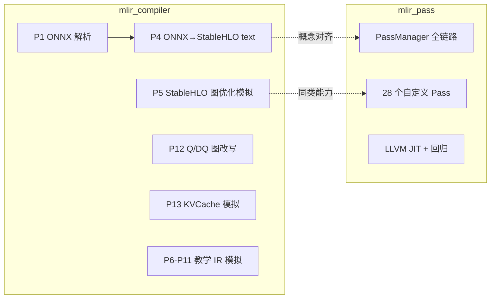

# 编译器能力映射

> 学习导读：[`两仓库学习路径与代码导读.md`](./两仓库学习路径与代码导读.md)  
> 面试题库：[`AI_COMPILER_INTERVIEW.md`](./AI_COMPILER_INTERVIEW.md)  
> 生成目的：面试前核对表述、定位强项、规划下一轮代码补强。

---

## 1. 两项目定位（先读这一节，避免混写）

| 项目 | 仓库 | 核心角色 | 实现形态 |
|------|------|----------|----------|
| **项目一** | [mlir_pass](https://github.com/xdlhzdh/mlir_pass) | 真实 MLIR C++ 端到端 pipeline | StableHLO → Linalg → Bufferize → SCF/Affine/Vector → LLVM + JIT |
| **项目二** | [mlir_compiler](https://github.com/xdlhzdh/mlir_compiler) | 传统编译器 + AI 编译器全流程教学 | P1/P4 偏真实；P5–P13/P14 为教学级 `*_ir.h` 模拟 |



**一句话分工：**

- `mlir_compiler` 教会你 **AI 编译器地图**（ONNX 前端 → StableHLO → Linalg → Bufferize → Loop/Vector → LLVM/GPU → 量化/内存）。
- `mlir_pass` 证明你能 **在真实 MLIR 上落地**（PassManager、自定义 Pass、多路径 lowering、JIT、LIT/Shell 回归）。

---

## 2. 模板能力维度总览

模板简历可拆为 8 个可核对维度：

| # | 维度 | 模板典型表述 |
|---|------|-------------|
| A | 框架前端接入 | PyTorch Dynamo / FX / TorchScript / ONNX |
| B | MLIR 基础设施 | Dialect、Pass、Lowering、PassManager |
| C | 图优化 | Fusion、常量折叠、布局转换、DCE/CSE |
| D | Transformer / LLM | Attention、RMSNorm、RoPE、KVCache |
| E | 动态 Shape | Shape Inference、变长输入、内存规划 |
| F | 量化前端 | Q/DQ、QAT、INT8/FP8、混合精度 |
| G | 测试与工程化 | 算子对齐、LIT、CI、Benchmark |
| H | 大模型专项 | Graph Partitioning、多卡、端到端 LLM 编译 |

后文按此 8 维逐条映射。

### 2.1 AI 编译器重点知识缺口复盘（P10 + A1–B6）

| 知识域 | 状态 | 验证 | 面试边界 |
|--------|------|------|----------|
| CHLO↔StableHLO + GELU linalg | **已补强** | `gelu_linalg_smoke` + shell | 非全 CHLO 算子集 |
| numpy Broadcast 图优化 | **已补强** | `broadcast-simplify` + e2e + golden | 规则匹配，非全图 |
| **A1** Shape refine / get_dim | **已补强（教学）** | `shape_refine_batch` / `shape_get_dimension_size` | 官方 `refine-shapes`，非全图推断 |
| **A2** Layout NHWC fold | **已补强（P4 e2e）** | `layout-fold` + `test_layout_e2e` | LIT 简单 fixture 仅消 transpose |
| **A3** Linalg tile | **已补强（仅 tile）** | `linalg_tile_*` + shell | **非**工业 tile-fuse kernel |
| **A4** torch-mlir Conv+BN | **已补强（fusion）** | `test_torch_e2e` | **无 Conv CPU JIT** |
| **A5** FFN JIT 数值校验 | **已补强** | `test_jit_golden` **6 项**：编译执行后和 NumPy 比对（含 gelu/swiglu） | sigmoid 快速路径 + erf 全链路 |
| **A6** PTQ calib→quant | **已补强（教学）** | `run_calib_to_quant` | **未**用 JSON 驱动 INT8 kernel |
| **B1–B6** 图折叠 / KV / 分区 / flash / 动态维 / f16 | **已补强** | §7.38–7.43 | 图级标注，非 GPU kernel |
| **C1–C10** 第三档 | **概念-only** | [INTERVIEW 附录 B](./AI_COMPILER_INTERVIEW.md) | 简历勿夸大 |

**结论：** 第一、二档教学闭环已完成；工业级全栈缺口见 **§2.2**。

### 2.2 工业级全栈编译器缺口（本项目刻意未做）

> 下列能力在工业编译器中常见，**本项目未实现**；面试与简历须诚实标注。概念答法见 [INTERVIEW 附录 C](./AI_COMPILER_INTERVIEW.md#附录-c工业级全栈缺口速查)。

| 知识域 | 工业方案 | 本项目边界 | 简历禁止表述 |
|--------|----------|------------|--------------|
| Conv/GPU lowering + JIT | cuDNN/cuBLAS；conv→LLVM/GPU | matmul JIT only；conv 无 LLVM 路径 | 「Conv 端到端 JIT / GPU 下发」 |
| 真 Tile-and-Fuse kernel | L1 内 fuse producer/consumer | `custom-linalg-tile` 2×2 教学 | 「完整 tile-fuse pipeline」 |
| 校准 scale 驱动量化改写 | JSON→Q/DQ 图改写→INT8 kernel | `run_calib_demo` + Stage 2 grep | 「校准 JSON 驱动 INT8 加速」 |
| FlashAttention-2 / online softmax IR | tiled online softmax kernel | `flash-attention-tile` 属性标注 | 「实现了 FlashAttention kernel」 |
| QAT / FP8 / 训练量化 | fake quant + FP8 GEMM | PTQ calib demo only | 「QAT/FP8 推理提升 XX%」 |
| TP/PP + NCCL | 多卡 collective runtime | P14 编译期切分 + comm bytes | 「多卡分布式 runtime」 |
| Dynamo / 自定义 Dialect | FX trace + TableGen dialect | ONNX + `aicom.*` 标注 | 「实现 Dynamo / XX Dialect」 |
| 全模型 benchmark | 固定 harness + 可复现数字 | Roofline 概念 only | 「LLaMA 全编译 / 吞吐提升」 |
| Paged KV / continuous batching | PagedAttention runtime | P13 静态 plan 概念 | 「PagedAttention runtime」 |

**延伸阅读（第四档，未写代码）：** TOSA 移动端路径、ONNX Custom Op 注册、Pass 耗时统计 — 见原缺口清单第四档。

---

## 3. 模板契合度映射表（核心）

**等级说明：**

| 等级 | 含义 |
|------|------|
| **强契合** | 有真实代码 + 可运行验证；可放心写进简历/面试 |
| **部分契合** | 有实现但范围窄，或仅为子图/标注/单点能力 |
| **概念契合** | 教学模拟或文本 IR，理解到位但非生产级 |
| **缺口** | 模板有、项目无；不可夸大 |

### 3.0 等级晋升规则（部分契合 ↔ 强契合）

**何时可从「部分契合」升为「强契合」**（须**全部**满足）：

| # | 条件 | 说明 |
|---|------|------|
| 1 | **真实代码** | 非纯文档/口头；compiler 或 pass 有可定位源文件 |
| 2 | **双重验证** | 至少两种：参考实现校验 / LIT / shell / 跨仓库 e2e / JIT 数值校验 |
| 3 | **可复现命令** | README 或 §10 有一条命令一键验收 |
| 4 | **面试边界诚实** | 标注类须能说清「非 kernel / 非专用 Dialect」 |

**仍保持「部分契合」不晋升**（即使有测试）：

| 类型 | 原因 | 示例 |
|------|------|------|
| 仅标注、无结构改写 | 工业「融合」常指 kernel 级 | layout / elementwise / producer-consumer 标注 |
| 仅 fixture 桥接 | 无对应 pass 或 runtime | graph partition smoke |
| compiler 单侧概念 | pass 侧无落地 | KVCache 规划（pass 仅 boundary 标注） |
| 子集能力 | 未覆盖模板全称 | 动态 batch（非任意 rank 推导） |

**双仓库互补晋升**：同一能力在 compiler 有 golden、pass 有 e2e 时，**组合叙事**可升为强契合（见下表「等级」列合并表述）。

---

| 模板要求 | mlir_pass | mlir_compiler | 等级 |
|----------|-----------|---------------|------|
| ONNX 模型导入 | 无（手写 StableHLO `.mlir` 输入） | P1 [`1_onnx_parse/run_onnx_parse.cpp`](../1_onnx_parse/run_onnx_parse.cpp)：Protobuf 解析 GraphProto | compiler **强契合** |
| ONNX → IR Lowering | 无 | P2 [`2_onnx_to_ir/`](../2_onnx_to_ir/) → mini IR | compiler **强契合** |
| PyTorch / FX / Dynamo | `scripts/torch_export/`（torch-mlir 导出 + fx/onnx demo） | 无 | **缺口** |
| TorchScript / JAX | 无 | 无 | **缺口** |

### B. MLIR 基础设施

| 模板要求 | mlir_pass | mlir_compiler | 等级 |
|----------|-----------|---------------|------|
| PassManager 多阶段编排 | [`lib/Pipeline/Pipeline.cpp`](../../../../../mlir_pass/lib/Pipeline/Pipeline.cpp)，`--pipeline-stop-after` / `--dump-ir` | 无统一 PM（分段 demo） | pass **强契合** |
| 自定义 Pass（TableGen） | **28** 个：[`include/AICompiler/Passes.td`](../../../../../mlir_pass/include/AICompiler/Passes.td) | 无（真实 MLIR Pass 全在 mlir_pass） | pass **强契合** |
| Dialect Conversion / Lowering | 官方 `convert-*` + `chlo-legalize-to-stablehlo` + `stablehlo-legalize-to-linalg` | P4 tier 3 教学框架 [`conversion_framework.h`](../4_onnx_to_stablehlo/conversion_framework.h) | pass **强契合**；compiler **概念契合** |
| 自定义 Dialect 设计 | 无 | 无 | **缺口** |

### C. 图优化

| 模板要求 | mlir_pass | mlir_compiler | 等级 |
|----------|-----------|---------------|------|
| Conv+Bias+ReLU 融合 | `conv-bn-fusion` + `conv-bn-relu-fusion`（真实 MLIR） | P3 mini_ir + P5 `5_stablehlo_opt` 模拟 | **强契合** |
| numpy-style Broadcast | `broadcast-simplify` + `test_broadcast_e2e` + golden | P4 tier 2 `lowering_broadcast.onnx` | **强契合** |
| 常量折叠 | `stablehlo-constant-fold` + `custom-linalg-opt` + LIT | P3 / P5 模拟 | **强契合** |
| One-Shot Bufferization | 真实 `one-shot-bufferize` + `custom-buffer-opt` + `bufferize_smoke` LIT | P7 教学模拟 | pass **强契合**；compiler **概念契合** |
| Linalg tiling/fusion | 官方 `linalg-fuse-elementwise-ops` + `custom-linalg-opt` | P6 教学模拟 | pass **强契合**；compiler **概念契合** |
| 多路径 lowering | `scf-seq` / `scf-par` / `affine` / `vector` + JIT | P8–P9 概念教学（scf/vector） | pass **强契合** |
| 布局转换 NCHW↔NHWC | `layout-bridge-legalize` 标注 + `test_layout_e2e` | P5 layout fold + `lowering_layout_conv.onnx` | **部分契合** |
| DCE / CSE | 官方 canonicalize / CSE（linalg/bufferize 阶段）+ `canonicalize_cse_smoke` LIT | P5 模拟 | pass **强契合**；compiler **概念契合** |
| Softmax 子图处理 | `softmax-legalize` + LIT + e2e + golden | P4 + `check_softmax` | **强契合**（分解+标注，非 fused kernel） |

### D. Transformer / LLM

| 模板要求 | mlir_pass | mlir_compiler | 等级 |
|----------|-----------|---------------|------|
| Softmax | `softmax-legalize` + LIT + e2e | `lowering_softmax.onnx` + golden | **强契合** |
| Scaled Dot-Product Attention | `attention-legalize` + `test_attention_e2e` + transformer e2e | `lowering_attention.onnx` + golden | **强契合** |
| RMSNorm | `rmsnorm-legalize` + e2e | `lowering_rmsnorm.onnx` + golden | **强契合** |
| LayerNorm | `layernorm-legalize` + e2e | `lowering_layernorm.onnx` + golden | **强契合** |
| RoPE | `rope-legalize` + e2e | `lowering_rope.onnx` + golden | **强契合** |
| GELU (FFN) | `gelu-legalize` + e2e + **linalg smoke**（CHLO legalize） | `lowering_gelu.onnx` + golden（`chlo.erf`） | **强契合** |
| SwiGLU (FFN) | `swiglu-legalize` + e2e | `lowering_swiglu.onnx` + golden | **强契合** |
| Q/DQ MatMul | `qdq-legalize` + `test_quant_e2e` **三条路径** | P4 + P12 + golden | **强契合** |
| MatMul + Bias 融合 | `matmul-bias-fusion` + e2e | `lowering_matmul_bias.onnx` + golden | **强契合**（标注类） |
| Horizontal GEMM 融合 | `horizontal-gemm-fusion` + e2e | `lowering_horizontal_gemm.onnx` + golden | **强契合**（标注类） |
| Elementwise 链融合 | `elementwise-chain-legalize` + LIT/shell | INTERVIEW Q14.9 概念 | **部分契合** |
| Producer-Consumer 融合 | `producer-consumer-legalize` + `lowering_matmul_softmax.onnx` e2e | INTERVIEW Q14.10 概念 | **部分契合** |
| 单层 Transformer block | `transformer_block_fusion_e2e.mlir` + e2e | `lowering_transformer_block.onnx` + golden | **强契合** |
| KVCache | `kvcache-legalize` 标注 + LIT | P13 Stage 7 [`run_memory_planning.cpp`](../13_memory_planning/run_memory_planning.cpp) | **部分契合**（compiler 概念 + pass 标注） |
| Transformer 专用 Dialect | 无 | 无 | **缺口** |
| LLaMA-7B 端到端编译 | 无 | 无 | **缺口** |

### E. 动态 Shape

| 模板要求 | mlir_pass | mlir_compiler | 等级 |
|----------|-----------|---------------|------|
| Shape Inference | 无 | P1 有限算子推断 | compiler **部分契合** |
| 动态 batch / `?` 维 | `test_dynamic_e2e` + `dynamic_batch.mlir` | `lowering_dynamic.onnx` + `check_dynamic` 两档 batch | **强契合**（限定：单动态维 batch 教学图） |
| 变长输入内存规划 | 无 | P13 ResNet + KVCache 场景 | compiler **概念契合** |

### F. 量化前端

| 模板要求 | mlir_pass | mlir_compiler | 等级 |
|----------|-----------|---------------|------|
| 校准 / Scale 计算 | 无 | P12 Stage 1–2 [`12_quantization/`](../12_quantization/) | compiler **概念契合** |
| Q/DQ 图改写 | `test_quant_e2e` 三条路径 | P12 Stage 4 + P4 Q/DQ lowering + golden | **强契合** |
| ONNX-QDQ 模型导入 | `test_quant_e2e` P12 链路 | `gen_quant_models.py` + P4 tier 3 | **强契合** |
| QAT / FP8 | 无 | 无 | **缺口** |
| 混合精度分析 | 无 | P12 Stage 5 敏感度表 | compiler **概念契合** |

### G. 测试与工程化

| 模板要求 | mlir_pass | mlir_compiler | 等级 |
|----------|-----------|---------------|------|
| Shell 回归 | **36** 项 [`scripts/test_shell_regression.sh`](../../../../../mlir_pass/scripts/test_shell_regression.sh) | 无等价脚本 | pass **强契合** |
| LIT / FileCheck | **39** 个 [`test/lit/*.mlir`](../../../../../mlir_pass/test/lit/) | 无 | pass **强契合** |
| CMake 阶段验证 | `test_lit_filecheck` / `test_shell_regression` | `run_lowering` / `run_quant` / `run_memplan` 等 | 两项目 **强契合**（形态不同） |
| 算子数值对齐 | **JIT 数值校验** `test_jit_golden` **6** 项（编译产物 vs NumPy）；shell 另有 JIT smoke | **参考实现校验** `run_onnx_golden` **18** 项（ORT vs NumPy，不跑编译器） | **强契合**（两套测试互补，勿混为一谈；见学习主文档 §1.4） |
| Benchmark / CI | [`.github/workflows/ci.yml`](../../../../../mlir_pass/.github/workflows/ci.yml) | 同上 | **强契合** |

### H. 大模型专项

| 模板要求 | mlir_pass | mlir_compiler | 等级 |
|----------|-----------|---------------|------|
| Graph Partitioning | `graph_partition_smoke.mlir` + `test_partition_smoke` | P14 `14_graph_partition/` Attention/FFN 切分教学 | **部分契合** |
| Tensor / Pipeline Parallel | 无 | 无 | **缺口** |
| KVCache 编译期优化 | 无 | P13 Stage 7 模拟 | compiler **概念契合** |
| 首字延迟 / 吞吐量数据 | 无 | 无 | **缺口** |

---

## 4. 模板工作经历 / 项目叙事对照

### 4.1 模板「核心业绩」→ 你的对应证据

| 模板业绩表述 | 可对应项目能力 | 建议归属 | 是否可直接写 |
|-------------|---------------|----------|-------------|
| PyTorch Dynamo / AOTAutograd 前端 | 无 | — | **不可写** |
| MLIR 前端 Dialect + Lowering | Pass + StableHLO lowering | mlir_pass + P4 | **可写**（不说 Dynamo） |
| Conv+Bias+ReLU 等图优化 Pass | conv-bn / conv-bn-relu fusion | mlir_pass + P3 | **可写** |
| 动态 Shape + 维度推导 | P4 dynamic + P1 shape infer | mlir_compiler | **可写**（注明教学/有限算子） |
| TVM Relay 算子适配 | 无 | — | **不可写** |
| ONNX-QDQ 量化前端 | P12 Q/DQ 图改写 | mlir_compiler | **可写**（注明教学 IR） |
| 算子对齐测试框架 | LIT + run_onnx_golden + test_jit_golden + e2e | mlir_pass + P4 | **可写** |

### 4.2 模板「大模型编译前端」项目 → 你的对应

| 模板条目 | 你的实现 | 差距 |
|----------|----------|------|
| Transformer Dialect（Attention/RMSNorm/RoPE） | P4 分解 + pass 标注 + **11 fixture e2e** + block golden | 无专用 Dialect；子图级 **强契合** |
| Graph Partitioning / 多卡 | P14 Attention/FFN 切分教学 | 无 runtime / NCCL |
| KVCache 编译期内存分析 | P13 Stage 7 | 模拟级，无 runtime |
| LLaMA-7B 全编译 + 性能提升 XX% | 无 | 不可写任何 LLaMA/性能数字 |

### 4.3 模板「Torch-FX-Transformer」→ 你的对应

| 模板条目 | 你的实现 |
|----------|----------|
| FX SymbolicTracer | 无 |
| 自定义 Trace Pass | 无 |
| ONNX Export | P1–P4 ONNX 链路（C++ 侧，非 FX） |

---

## 5. 除模板外：当前 AI 编译器热点契合度

模板未写、但 2024–2026 前端岗常见的补充维度：

| 热点能力 | mlir_pass | mlir_compiler | 说明 |
|----------|-----------|---------------|------|
| StableHLO / XLA 生态 | 入口 dialect + fusion pass | P4 text IR + P5 优化链 | pass 更「真」 |
| One-Shot Bufferization | 真实 `one-shot-bufferize` | P7 教学模拟 | pass **强** |
| 多路径 CPU lowering | scf-seq / scf-par / affine / vector 四条 | P8–P9 分阶段模拟 | pass **强** |
| LLVM JIT 执行 | `pipe-demo --jit`（打印结果）+ `test_jit_golden`（自动比对） | 无 | pass 独有 |
| torch-mlir 导出 | `scripts/torch_export/conv_bn_model.py` 单模型 | 无 | 入门级 |
| LLM decode / paged KV | 无 | P13 KVCache 规划 | 概念级 |
| FlashAttention / fused MHA | `attention-legalize` 子图标注（decomposition + 边界标记，非 kernel） | 无真实 kernel | **部分契合**（理解 tiled online softmax，未实现 GPU kernel） |
| 算子数值对齐 | `test_jit_golden`（JIT vs NumPy）+ shell JIT smoke | `run_onnx_golden.py`（ORT vs NumPy，**18** 项） | 两仓库 **强契合**（对象不同：编译产物 vs 参考实现） |
| CHLO→StableHLO 桥接 | linalg stage 内置 `chlo-legalize-to-stablehlo` | P4 GELU 导出 `chlo.erf` | **强契合**（教学管线） |
| 异构 / Memory Hierarchy | JIT + buffer opt | P13 + 早期 DSP/FPGA 项目 | 可关联叙事 |

---

## 6. 跨仓库能力组合（面试时如何讲「完整故事」）

单独讲任一仓库都不完整；推荐组合叙事：

```text
mlir_compiler（地图）          mlir_pass（落地）
─────────────────────          ────────────────────
ONNX 解析 P1                   ← 输入从哪来
ONNX → StableHLO P4            → 手写/导出 StableHLO .mlir
ConversionPattern 框架           → 同类思想，真实 MLIR rewrite
StableHLO 优化 P5              → fusion / linalg / bufferize 真实 pass
Linalg / Bufferize P6–P7       → 真实 one-shot-bufferize
SCF / Affine / Vector P8–P9    → 四条 --loop-mode 路径
量化 / KVCache P12–P13         → 前端图语义理解（规划/改写）
                               → JIT 证明数值正确
```

**推荐面试句：**

> 「`mlir_compiler` 让我按 P1–P14 把 AI 编译器全链路走通；`mlir_pass` 是我在真实 MLIR 上把 StableHLO 子图降到 LLVM 并 JIT 跑通的工程化实现。」

---

## 7. 建议补强的硬核能力（按性价比排序）

> 原则：**有测试通过后再更新表述**。

### P0 — 已完成（2026-06）

#### 7.1 参考实现校验（`run_onnx_golden`，ORT vs NumPy） ✅

| 项 | 内容 |
|----|------|
| **状态** | 已实现：`run_onnx_golden.py` + CMake target `run_onnx_golden` |
| **在比什么** | 同一个 `.onnx`：ONNX Runtime 输出 **vs** NumPy 参考实现（**不跑** lowering / MLIR / JIT） |
| **目的** | 认证测试脚本里的 NumPy 参考实现与 ONNX 官方语义一致（「先认证裁判」） |
| **覆盖** | 18 项（17 个 lowering CHECKS + `--quant-dir` 的 QDQ） |
| **验证** | `cmake --build build --target run_onnx_golden`（18/18 PASS） |
| **简历可写** | 「用 ONNX Runtime 认证 Softmax/Attention/RMSNorm/RoPE 等子图的 NumPy 参考实现」 |
| **别和 JIT 混淆** | 真正「编译后跑机器码再对数值」的是 pass 侧 `test_jit_golden`（§7.24） |

#### 7.2 RoPE 小 fixture + lowering decomposition ✅

| 项 | 内容 |
|----|------|
| **状态** | 已实现：`lowering_rope.onnx`；`Sin`/`Cos`/`Slice`/`Concat` pattern |
| **验证** | `run_lowering` 输出含 `stablehlo.slice`/`concatenate`/`multiply`/`add`；golden 通过 |
| **简历可写** | 「扩展 ONNX→StableHLO lowering，覆盖 RoPE 旋转位置编码子图分解」 |

### P1 — 已完成（2026-06）

#### 7.3 mlir_pass 动态 batch smoke（LIT） ✅

| 项 | 内容 |
|----|------|
| **状态** | 已实现：`test/lit/dynamic_batch.mlir` |
| **验证** | `ninja -C build test_lit_filecheck`（6/6 PASS，含 fusion + linalg） |
| **简历可写** | 「扩展 pipeline 对动态 batch 维度的 StableHLO 输入支持」 |

#### 7.4 P12 ONNX QDQ 模型 fixture ✅

| 项 | 内容 |
|----|------|
| **状态** | 已实现：`gen_quant_models.py` → `quant_qdq_matmul.onnx`；`onnx_qdq_import.cpp`；`run_quant_qdq` |
| **验证** | `cmake --build build --target run_quant_qdq`（识别 3 Q + 3 DQ + MatMul，改写为 qlinear_matmul） |
| **简历可写** | 「支持 ONNX QDQ 模型导入并转换为 qlinear 推理图」 |

### P2 — 已完成（2026-06）

#### 7.5 mlir_pass StableHLO 常量折叠 pass ✅

| 项 | 内容 |
|----|------|
| **状态** | 已实现：`stablehlo-constant-fold` pass + `test/lit/constant_fold.mlir` |
| **验证** | `test_lit_filecheck`（7/7）+ shell regression |
| **简历可写** | 「实现 StableHLO 图级常量折叠 pass，编译期折叠 add/mul 常量子图」 |

#### 7.6 NCHW/NHWC layout 转换 ✅

| 项 | 内容 |
|----|------|
| **状态** | 已实现：P5 Stage 4 `pass_nchw_nhwc_layout` / `pass_nhwc_nchw_layout` |
| **验证** | `cmake --build build --target run_shlo_opt`（Stage 4b 测试通过） |
| **简历可写** | 「实现 Conv 输出/输入 NCHW↔NHWC layout 折叠，消除冗余 transpose」 |

### P3 — 已完成（2026-06）

#### 7.7 Attention ONNX → StableHLO → mlir_pass fusion（跨仓库 e2e） ✅

| 项 | 内容 |
|----|------|
| **状态** | 已实现：`mlir_compiler` `run_level3 --mlir-only` 导出 + `scripts/run_attention_e2e.sh`；fixture `test/fixtures/attention_p4.mlir`；LIT `attention_fusion_e2e.mlir` |
| **验证** | `ninja -C build test_attention_e2e` + `test_lit_filecheck`（8/8 PASS） |
| **简历可写** | 「串联 ONNX Attention lowering 与 mlir_pass fusion pipeline，验证 Scaled Dot-Product Attention 子图端到端图优化」 |

#### 7.8 mlir-opt plugin 暴露 fusion passes ✅

| 项 | 内容 |
|----|------|
| **状态** | 已实现：`tools/mlir-opt-plugin/AICompilerPlugin.so`；`aicom-fusion` pass pipeline；`run_aicom_mlir_opt.sh` |
| **验证** | `ninja -C build test_mlir_opt_plugin` |
| **简历可写** | 「将 fusion stage passes 封装为 mlir-opt dialect/pass plugin，支持 `mlir-opt --load-pass-plugin` 工业工作流」 |

### P4 — 已完成（2026-06）

#### 7.9 `rmsnorm-legalize` pass ✅

| 项 | 内容 |
|----|------|
| **状态** | 已实现：`lib/Transforms/RMSNormLegalize.cpp`；识别 `square → reduce → add eps → sqrt → divide → multiply weight` 分解链，标注 `aicom.rmsnorm_canonicalized` |
| **验证** | `test/lit/rmsnorm_legalize.mlir` + shell regression + `test_transformer_e2e` |
| **简历可写** | 「实现 RMSNorm 分解子图识别与 canonicalization 标注 pass，与 softmax-legalize 协同服务 Transformer 前端图优化」 |

#### 7.10 `attention-legalize` pass（FlashAttention 面试桥接） ✅

| 项 | 内容 |
|----|------|
| **状态** | 已实现：`lib/Transforms/AttentionLegalize.cpp`；在 softmax 标注后的两连 `dot_general` 子图上标注 `aicom.scaled_dot_product_attention` |
| **验证** | `test/lit/attention_legalize.mlir` + `attention_fusion_e2e.mlir` CHECK 扩展 |
| **简历可写** | 「实现 Scaled Dot-Product Attention 子图边界标注；理解 FlashAttention tiled online softmax 原理，本项目为 decomposition + 标注非 kernel」 |

#### 7.11 Transformer 跨仓库 e2e（11 fixture） ✅

| 项 | 内容 |
|----|------|
| **状态** | `scripts/run_transformer_e2e.sh` 覆盖七件套 + GEMM/FFN/block 共 **11 fixture**；LIT 覆盖 RMSNorm/RoPE/LayerNorm 等 fusion e2e；CMake `test_transformer_e2e` |
| **验证** | `ninja -C build test_transformer_e2e` + `test_lit_filecheck`（39 项） |
| **简历可写** | 「串联 ONNX Transformer/FFN 子图 lowering 与 mlir_pass fusion pipeline 跨仓库端到端验证（11 fixture）」 |

#### 7.12 `rope-legalize` + Bufferization LIT ✅

| 项 | 内容 |
|----|------|
| **状态** | 已实现：`lib/Transforms/RoPELegalize.cpp` 标注 `aicom.rope_canonicalized`；`test/lit/bufferize_smoke.mlir` 验证 One-Shot Bufferization |
| **验证** | shell regression（18 项）+ LIT（14 项） |
| **简历可写** | 「补齐 RoPE 子图标注 pass；增加 bufferize stage LIT 覆盖 tensor→memref 转换」 |

#### 7.13 LayerNorm lowering + `layernorm-legalize` + 阶段 LIT 补强 ✅

| 项 | 内容 |
|----|------|
| **状态** | `lowering_layernorm.onnx` + golden；`layernorm-legalize` pass；`softmax_fusion_e2e` / `linalg_fusion_smoke` / `loops_smoke` LIT；`test_transformer_e2e` 已扩展为 11 fixture |
| **验证** | `run_onnx_golden`（18/18）+ `test_lit_filecheck`（39 项）+ `test_transformer_e2e` |
| **简历可写** | 「补齐 LayerNorm ONNX→StableHLO lowering 与 fusion 标注；Linalg/Loops 阶段 LIT 覆盖中端 lowering smoke」 |

#### 7.14 GELU lowering + `gelu-legalize` + golden/e2e ✅

| 项 | 内容 |
|----|------|
| **状态** | `lowering_gelu.onnx`（`Erf` 分解）；P4 `ErfOpConversion` + `chlo.erf` 文本；`gelu-legalize` 标注 `aicom.gelu_canonicalized` |
| **验证** | `run_onnx_golden`（7/7）+ `test_transformer_e2e`（含 gelu）+ `gelu_legalize.mlir` LIT |
| **简历可写** | 「扩展 Transformer FFN 子图：GELU ONNX→StableHLO（chlo.erf）+ fusion 标注 pass」 |

#### 7.15 Graph Partitioning 教学（P14）✅

| 项 | 内容 |
|----|------|
| **状态** | `14_graph_partition/run_graph_partition.cpp`：单层 Transformer Attention/FFN 切分、边界张量与通信量估算 |
| **验证** | `cmake --build build --target run_graph_partition_demo` |
| **简历可写** | 「实现编译期 Graph Partitioning 教学模拟：Attention/FFN 子图切分与跨分区通信量估算（无 runtime collective）」 |

#### 7.16 CSE/Canonicalize LIT smoke ✅

| 项 | 内容 |
|----|------|
| **状态** | `test/lit/canonicalize_cse_smoke.mlir`：linalg 阶段 `canonicalize`/`cse` + StableHLO→Linalg 转换 smoke |
| **验证** | `test_lit_filecheck`（21/21） |
| **简历可写** | 「Linalg 阶段 LIT 覆盖 canonicalize/CSE 与 StableHLO 消除验证」 |

#### 7.17 SwiGLU lowering + `swiglu-legalize` + golden/e2e ✅

| 项 | 内容 |
|----|------|
| **状态** | `lowering_swiglu.onnx`；`Neg`/`Exp` pattern；`swiglu-legalize` 标注 `aicom.swiglu_canonicalized` |
| **验证** | `run_onnx_golden`（8/8）+ `test_transformer_e2e`（含 swiglu）+ `swiglu_legalize.mlir` LIT |
| **简历可写** | 「扩展 LLM FFN SwiGLU 子图 ONNX→StableHLO lowering 与 fusion 标注 pass」 |

#### 7.18 `qdq-legalize` + 跨仓库 quant e2e ✅

| 项 | 内容 |
|----|------|
| **状态** | `qdq-legalize` 识别 `(x-zp)*scale` 双端 dequant + `dot_general`；`test/lit/qdq_legalize.mlir`；`test_quant_e2e` |
| **验证** | shell + LIT + `ninja -C build test_quant_e2e` |
| **简历可写** | 「在 mlir_pass 实现 Q/DQ MatMul 分解子图标注，与 P12 ONNX QDQ 图改写概念对齐」 |

#### 7.19 MatMul+Bias fusion + P4 QDQ 跨仓库 e2e ✅

| 项 | 内容 |
|----|------|
| **状态** | `matmul-bias-fusion` 标注 `aicom.matmul_bias_fused`；`lowering_matmul_bias.onnx`；`lowering_qdq_matmul.onnx`；`test_quant_e2e` 含 P4 导出链路 |
| **验证** | `run_onnx_golden`（10/10）+ `matmul_bias_fusion.mlir` LIT + shell + `test_transformer_e2e`（含 matmul_bias）+ `test_quant_e2e`（含 P4 qdq） |
| **简历可写** | 「实现 GEMM+Bias 融合标注 pass，并扩展 P4 QDQ MatMul ONNX→StableHLO→fusion 跨仓库验证」 |

#### 7.20 Horizontal GEMM fusion ✅

| 项 | 内容 |
|----|------|
| **状态** | `horizontal-gemm-fusion` 识别共享 LHS 的双 `dot_general` + 末维 `concatenate`，标注 `aicom.horizontal_gemm_fused`；P4 `lowering_horizontal_gemm.onnx` |
| **验证** | `run_onnx_golden`（11/11）+ LIT + shell + `test_transformer_e2e` |
| **简历可写** | 「实现水平 GEMM 融合标注 pass，覆盖 `concat(matmul(X,W1), matmul(X,W2))` 面试高频模式」 |

### P5 — 已完成（P9 九项补强）

#### 7.21 P12 Q/DQ ONNX → P4 → mlir_pass 全链路 ✅

| 项 | 内容 |
|----|------|
| **状态** | P4 `QuantizeLinear`/`DequantizeLinear` pattern；`check_quant_qdq_matmul`；`run_quant_e2e` 第三条 P12 路径 |
| **验证** | `run_onnx_golden` 18/18 + `test_quant_e2e` |
| **简历可写** | 「打通 P12 ONNX Q/DQ → P4 StableHLO → mlir_pass qdq-legalize 跨仓库验证」 |

#### 7.22 动态 Shape 跨仓库 e2e ✅

| 项 | 内容 |
|----|------|
| **状态** | `run_level2 --mlir-only`；`run_dynamic_e2e.sh`；`check_dynamic` batch=2/4 |
| **验证** | `test_dynamic_e2e` |
| **简历可写** | 「P4 动态 batch ONNX 导出与 mlir_pass fusion/linalg 跨仓库 e2e」 |

#### 7.23 Elementwise 链 + Producer-Consumer 标注 pass ✅

| 项 | 内容 |
|----|------|
| **状态** | `elementwise-chain-legalize`、`producer-consumer-legalize`；`lowering_matmul_softmax.onnx` |
| **验证** | LIT + shell + transformer e2e matmul_softmax case |
| **简历可写** | 「实现 Elementwise 链与 Producer-Consumer（GEMM→Softmax）融合边界标注 pass」 |

#### 7.24 JIT 数值校验（`test_jit_golden`） ✅

| 项 | 内容 |
|----|------|
| **状态** | `run_jit_golden.py`；`test_jit_golden`；6 个 `.mlir` case |
| **在比什么** | `pipe-demo --jit` 打印的数组 **vs** NumPy 参考实现（rtol/atol=1e-5） |
| **流程** | `.mlir` → 完整 pipeline → LLVM `ExecutionEngine` JIT → 解析 `JIT result` → `np.allclose` |
| **覆盖** | `matmul_add` / `jit_scale` / `jit_gelu` / `jit_gelu_p4` / `jit_swiglu` / `jit_swiglu_p4` |
| **验证** | `ninja -C build test_jit_golden`（6/6） |
| **简历可写** | 「建立 pipe-demo JIT 与 NumPy 数值对齐回归（MatMul/Bias、scale、GELU、SwiGLU）」 |
| **别和 smoke 混淆** | shell 里的 JIT 行只 `grep '1.5'`，不做完整数值比对 |

#### 7.25 单层 Transformer block ONNX + e2e ✅

| 项 | 内容 |
|----|------|
| **状态** | `lowering_transformer_block.onnx`；`transformer_block_fusion_e2e.mlir`；golden |
| **验证** | `test_transformer_e2e` 第 11 fixture |
| **简历可写** | 「构造 Pre-LN 单层 Transformer block ONNX fixture 并跨仓库验证 RMSNorm/Attention/SwiGLU 标注」 |

#### 7.26 Layout bridge 标注 + e2e ✅

| 项 | 内容 |
|----|------|
| **状态** | `layout-bridge-legalize`；`lowering_layout_conv.onnx`；`run_layout_e2e.sh` |
| **验证** | `test_layout_e2e` + LIT |
| **简历可写** | 「mlir_pass 侧对齐 P5 NCHW→NHWC layout 折叠语义的标注 pass」 |

#### 7.27 KVCache 标注 pass ✅

| 项 | 内容 |
|----|------|
| **状态** | `kvcache-legalize`；`kvcache_legalize.mlir`（`aicom.kv_role` → `kvcache_boundary`） |
| **验证** | shell + LIT |
| **简历可写** | 「decode 步 K/V 角色函数 KVCache 边界标注（教学，无 runtime）」 |

#### 7.28 Graph Partition fixture + smoke ✅

| 项 | 内容 |
|----|------|
| **状态** | `graph_partition_smoke.mlir`（`aicom.partition_boundary`）；`run_partition_smoke.sh` |
| **验证** | `test_partition_smoke` |
| **简历可写** | 「P14 图切分 demo 与 mlir_pass partition 边界 fixture 概念串联」 |

#### 7.29 双仓库 GitHub Actions CI ✅

| 项 | 内容 |
|----|------|
| **状态** | `mlir_compiler/.github/workflows/ci.yml`；`mlir_pass/.github/workflows/ci.yml` |
| **验证** | push/PR 触发；mlir_pass full job 依赖预装 MLIR |
| **简历可写** | 「两仓库 CI：compiler golden/demo + pass 全量回归（MLIR 环境可选）」 |

### P6 — 已完成（P10 知识缺口补强）

#### 7.30 CHLO→StableHLO + GELU Linalg smoke ✅

| 项 | 内容 |
|----|------|
| **状态** | `buildStableHloToLinalgStage` 插入 `chlo-legalize-to-stablehlo`；`gelu_linalg_smoke.mlir` + shell 回归 |
| **验证** | `test_lit_filecheck`（33/33）+ shell regression |
| **简历可写** | 「在真实 MLIR pipeline 接入 CHLO 合法化，使 GELU（chlo.erf）可降至 Linalg」 |

#### 7.31 Broadcast 图优化 + 跨仓库 e2e + golden ✅

| 项 | 内容 |
|----|------|
| **状态** | `broadcast-simplify` pass；`run_broadcast_e2e.sh`；`check_broadcast` golden |
| **验证** | `test_broadcast_e2e` + LIT + golden 18/18 |
| **简历可写** | 「实现 StableHLO 冗余 broadcast 折叠 pass，并与 P4 numpy broadcast lowering golden/e2e 对齐」 |

#### 7.32 Shape 收窄（A1）✅

| 项 | 内容 |
|----|------|
| **状态** | `buildStableHloToLinalgStage` 插入 `stablehlo-refine-shapes`；`shape_refine_batch.mlir` LIT |
| **验证** | `tensor.cast` 将 `?x3` 收窄为 `2x3` + shell/LIT |
| **简历可写** | 「教学级 dynamic batch shape 收窄：静态 bias 参与 refine-shapes 后再 lower」 |

#### 7.33 Layout 真折叠（A2）✅

| 项 | 内容 |
|----|------|
| **状态** | `layout-fold` pass：消除 conv + NCHW→NHWC transpose；`layout_bridge_legalize.mlir` + `test_layout_e2e` |
| **验证** | LIT `CHECK-NOT: stablehlo.transpose` + shell |
| **简历可写** | 「消除冗余 layout transpose（常量 kernel conv 后接 perm [0,2,3,1]）」 |

#### 7.34 Linalg tile-and-fuse 教学样例（A3）✅

| 项 | 内容 |
|----|------|
| **状态** | `custom-linalg-tile`：`tileLinalgOp` 2×2×2 strip-mine `linalg.matmul`；`linalg_tile_smoke.mlir` |
| **验证** | LIT `scf.for` + `aicom.linalg_tiled` + shell |
| **简历可写** | 「tensor 级 matmul tile 教学 fixture，理解 tile 粒度与 cache」 |

#### 7.35 torch-mlir Conv+BN e2e（A4）✅

| 项 | 内容 |
|----|------|
| **状态** | `run_torch_e2e.sh`：`scripts/torch_export/conv_bn_model.py`（torch-mlir 导出 Conv+BN）或 `conv_bn_torch.mlir` fixture → fusion（现已完全在 mlir_pass 内，无跨仓库依赖） |
| **验证** | `test_torch_e2e` |
| **简历可写** | 「torch-mlir StableHLO 导出 + mlir_pass fusion 串联（不写 Dynamo）」 |

#### 7.36 FFN JIT 数值校验（A5）✅

| 项 | 内容 |
|----|------|
| **状态** | 在 `test_jit_golden` 的 6 项里纳入 GELU/SwiGLU（含 P4 导出 fixture + sigmoid 快速路径） |
| **在比什么** | FFN 子图经整条 pipeline JIT 后的结果 **vs** NumPy 参考实现 |
| **验证** | `test_jit_golden` 6/6（GELU P4 `atol=1e-3`） |
| **简历可写** | 「FFN 子图降至 LLVM 后与 NumPy 数值对齐」 |

#### 7.37 PTQ 校准可运行 demo（A6）✅

| 项 | 内容 |
|----|------|
| **状态** | `run_calib_demo.py` + `run_calib_to_quant.sh`；CMake `run_calib_to_quant` |
| **验证** | `cmake --build build --target run_calib_demo run_calib_to_quant` |
| **简历可写** | 「校准 min/max → scale JSON → quant Stage 2 串联（教学）」 |

### P7 — B1–B6 第二档补强

#### 7.38 Elementwise / Producer-Consumer 真图折叠（B1）✅

| 项 | 内容 |
|----|------|
| **状态** | `maximum→clamp` erase；`exp(sub)→mul(exp,exp(-max))` erase subtract |
| **验证** | LIT `CHECK-NOT` + `run_transformer_e2e` `!stablehlo.subtract` + shell |
| **简历可写** | 「StableHLO 图级 ReLU/softmax-exp 子图真折叠（非 CUDA kernel）」 |

#### 7.39 KV decode e2e + P13（B2）✅

| 项 | 内容 |
|----|------|
| **状态** | `lowering_decode_step.onnx`；`run_kvcache_e2e.sh`；`test_kvcache_e2e` |
| **验证** | `test_kvcache_e2e`：fusion + `kvcache_boundary` + P13 decode |
| **简历可写** | 「decode 步 ONNX → kvcache 标注 + 内存规划概念串联」 |

#### 7.40 Graph Partition comm golden（B3）✅

| 项 | 内容 |
|----|------|
| **状态** | `sync_partition_fixture.py`；升级 `run_partition_smoke.sh` |
| **验证** | `test_partition_smoke` |
| **简历可写** | 「P14 通信量 stdout 与 partition fixture 对齐」 |

#### 7.41 FlashAttention tile 标注（B4）✅

| 项 | 内容 |
|----|------|
| **状态** | `flash-attention-tile` pass；`flash_attention_tile.mlir` |
| **验证** | shell + LIT |
| **简历可写** | 「SDP 子图 flash tile 属性标注（教学，非 FlashAttention-2 kernel）」 |

#### 7.42 多动态维 + decode 循环 fixture（B5）✅

| 项 | 内容 |
|----|------|
| **状态** | `lowering_dynamic_mn.onnx`；`decode_loop.mlir`；扩展 `run_dynamic_e2e.sh` |
| **验证** | `test_dynamic_e2e` + golden `check_dynamic_mn` |
| **简历可写** | 「双动态维 MatMul + scf.while 教学循环」 |

#### 7.43 FP16 MatMul golden（B6）✅

| 项 | 内容 |
|----|------|
| **状态** | `lowering_matmul_f16.onnx`；`check_matmul_f16` |
| **验证** | `run_onnx_golden` 18 项 |
| **简历可写** | 「FP16 dtype lowering + f32 cast golden（无 FP16 kernel 优化）」 |

### 第三档（概念-only）

见 [`AI_COMPILER_INTERVIEW.md` 附录 B](./AI_COMPILER_INTERVIEW.md#附录-b第三档概念答法简历勿夸大)（C1–C10）。

### 不建议短期做

| 项 | 原因 |
|----|------|
| PyTorch Dynamo / FX Tracer | 工程范围大，与现有结构不匹配 |
| Graph Partitioning / 多卡并行 | P14 编译期切分教学；无硬件拓扑与 runtime |
| LLaMA-7B 端到端 + 性能数字 | 无法诚实验证 |
| 真实 GPU kernel 下发 | P11 为 PTX 文本模拟 |
| FP8 / QAT 训练链路 | 超出教学项目边界 |

---

## 8. 面试表述：安全 vs 需谨慎

### 8.1 推荐表述

| 场景 | 推荐说法 |
|------|----------|
| 端到端 MLIR | 「`mlir_pass` 基于真实 MLIR PassManager，将 StableHLO 子图经 Linalg、Bufferize、SCF/Affine/Vector 降至 LLVM，并用 ExecutionEngine JIT 验证数值。」 |
| ONNX 前端 | 「`mlir_compiler` P1 用 Protobuf 解析 ONNX，P2 降到 mini IR，P4 实现三级 ONNX→StableHLO lowering。」 |
| Transformer | 「P4 tier 3 分解 Softmax/Attention/RMSNorm/RoPE/LN/GELU/SwiGLU；mlir_pass 标注 pass + **11 fixture** 跨仓库 e2e + 单层 transformer block」 |
| Bufferization | 「`mlir_pass` 接入真实 `one-shot-bufferize`，配合 `custom-buffer-opt` 与 bufferize LIT。」 |
| 测试 | 「`mlir_pass` Shell **36** 项 + LIT **39** 项 + **10** 条跨仓库 e2e + JIT 数值校验 **6** 项；`mlir_compiler` 参考实现校验 `run_onnx_golden` **18** 项 + `run_calib_to_quant` + CI。工业级缺口见 **§2.2**。」 |

### 8.2 需谨慎或禁止的表述

| 不建议说法 | 应改为 |
|-----------|--------|
| 「实现了 PyTorch Dynamo 前端」 | 「熟悉 ONNX/StableHLO 前端路径；torch-mlir 用于 Conv+BN 导出 demo」 |
| 「实现了 Transformer Dialect」 | 「通过 ONNX primitive 分解表达 Transformer 子图」 |
| 「P6–P13 都是真实 MLIR Pass」 | 「P6–P13 是教学级 IR 模拟，对应工业 pass 链语义」 |
| 「实现了 LLaMA-7B 全编译」 | 不提 |
| 「KVCache runtime / FlashAttention kernel」 | 「编译期 KV 内存规划模拟；FlashAttention 为原理理解 + 子图标注，非 GPU kernel」 |
| 「INT8 推理性能提升 XX%」 | 「量化图改写 + 模型体积/混合精度分析（教学估算）」 |
| 「softmax-legalize 融合了 Attention」 | 「识别 softmax 分解子图并标注边界，便于后续 pass 分析」 |
| 「实现了 FlashAttention kernel」 | 「理解 tiled online softmax 原理；本项目为 decomposition + `aicom.scaled_dot_product_attention` 子图标注」 |

### 8.3 高频面试考点覆盖索引

> 面试前快速定位：哪个维度有代码证据、对应面试题库哪一节。题库全文见 [`AI_COMPILER_INTERVIEW.md`](./AI_COMPILER_INTERVIEW.md)。

| 维度 | 个人项目证据 | 面试参考 |
|------|-------------|----------|
| A 框架接入 | P1 ONNX 解析、P4 lowering、ConversionPattern | INTERVIEW §2、§4 |
| B MLIR 基础 | PassManager、28 个 teaching pass、GreedyPatternRewrite、mlir-opt plugin | §5 |
| C 图优化 | Conv+BN+ReLU、常量折叠、CSE/DCE（官方 pass）、layout | §3、§14 |
| D Transformer | Softmax/Attn/RMSNorm/LayerNorm/RoPE 分解 + `aicom.*_canonicalized` 标注 | §14（FlashAttention 原理） |
| E 动态 Shape | dynamic_batch LIT、P4 tier 2 | §2 |
| F 量化 | P12 Q/DQ、run_quant_qdq | §12 |
| G 测试 | compiler 参考实现校验 18 + pass JIT 数值校验 6、LIT 39、shell 36、10 条跨仓库 e2e | §15 |
| H 大模型专项 | KVCache 内存规划模拟 only | §13 |
| I Bufferization | 真实 `one-shot-bufferize` + `custom-buffer-opt` + `bufferize_smoke` LIT | §7 |
| J Linalg | 官方 `linalg-fuse-elementwise-ops` + `linalg_fusion_smoke` LIT | §6 |
| K 多路径 Lowering | 四条 `--loop-mode` + `loops_smoke`/`affine`/`vector` LIT + JIT | §8、§9、§10 |
| L Dialect Conversion | P4 `applyFullConversion` 框架 + mlir_pass 官方 lowering pass | §4 |

**两个高频追问的准备说辞：**

- **FlashAttention**：标准 Attention 物化 \(N\times N\) 矩阵；FlashAttention 用分块在线 softmax 将内存从 \(O(N^2)\) 降到 \(O(N)\)。本项目用 primitive 分解 + `aicom.*_canonicalized` 标注子图边界，便于后续融合分析。
- **PatternRewrite**：自定义 pass 基于 `OpRewritePattern` + `applyPatternsAndFoldGreedily`（贪心固定点迭代）；fusion stage 中标注 pass 须在常量折叠之前运行，避免破坏结构匹配。

---

## 9. 能力条目与证据快查

| 能力条目（摘要） | 主要证据 | 等级 |
|----------------|----------|------|
| 28 个自定义 Teaching Pass | mlir_pass `Passes.td` + `RegisterPasses.cpp` | 强契合 |
| CHLO→StableHLO + GELU linalg | `StableHLOToLinalg.cpp` + `gelu_linalg_smoke.mlir` | 强契合 |
| Broadcast 图优化 | `broadcast-simplify` + `test_broadcast_e2e` + golden | 强契合 |
| Transformer 子图（七件套+FFN） | P4 golden + pass 标注 + 11 fixture e2e | **强契合**（注明：标注非 Dialect） |
| Q/DQ 全链路 | P12→P4→`test_quant_e2e` | **强契合** |
| 动态 batch e2e | `test_dynamic_e2e` + golden | **强契合** |
| Transformer block | `lowering_transformer_block` + e2e | **强契合** |
| Elementwise / Producer-Consumer | B1 真图折叠 + LIT CHECK-NOT | **强契合**（图级） |
| Layout / KVCache / Partition | A2 NHWC + B2–B3 e2e | **强契合** |
| JIT 数值校验 | `test_jit_golden`（编译产物 vs NumPy） | 强契合（与 `run_onnx_golden` 互补，对象不同） |
| One-Shot Bufferization | `Bufferization.cpp` + `bufferize_smoke.mlir` LIT | 强契合 |
| Pass Pipeline 多路径 | `PipelineStages.cpp` + `--loop-mode` | 强契合 |
| LLVM JIT | `main.cpp` ExecutionEngine | 强契合 |
| ONNX 解析 + mini IR | mlir_compiler P1/P2 | 强契合 |
| ONNX→StableHLO + ConversionPattern | P4 tier 3 + `run_lowering` | 强契合（text IR） |
| Transformer 十一 fixture e2e | `run_transformer_e2e.sh` | **强契合** |
| Attention/RMSNorm/RoPE lowering | P4 fixture + golden | **强契合** |
| FlashAttention 理解 | `attention-legalize` + `flash-attention-tile` | **强契合**（标注，非 kernel） |
| KVCache memory planning | P13 + `test_kvcache_e2e` | **强契合**（编译期） |
| Linalg/Bufferize/SCF/Vector/LLVM/GPU 梳理 | P6–P11 模拟 | 概念契合 |

---

## 10. 验证命令速查

**mlir_pass**（[`README.md`](../../../../../mlir_pass/README.md)）：

```bash
cmake -B build -G Ninja -DCMAKE_PREFIX_PATH=/usr/local -DSTABLEHLO_LIB_DIR=/usr/local/lib
ninja -C build test_shell_regression      # 36 项
ninja -C build test_lit_filecheck         # 39 项
ninja -C build test_transformer_e2e       # 11 fixture
ninja -C build test_quant_e2e
ninja -C build test_dynamic_e2e
ninja -C build test_kvcache_e2e
ninja -C build test_jit_golden                # JIT 数值校验：编译执行 vs NumPy（6 项）
ninja -C build test_layout_e2e
ninja -C build test_broadcast_e2e
ninja -C build test_partition_smoke
ninja -C build test_mlir_opt_plugin
```

**mlir_compiler**（[`README.md`](../../../../README.md)）：

```bash
cmake -B build && cmake --build build --target run_lowering run_onnx_golden run_quant_qdq run_calib_to_quant
cmake --build build --target run_memplan run_graph_partition_demo run_shlo_opt
```

---

## 11. 文档维护说明

- 代码补强后：先跑验证命令，再更新本文 §9 对应条目。
- 详细学习顺序、核心代码导读、e2e trace 与未覆盖知识补充见唯一主文档 [`两仓库学习路径与代码导读.md`](./两仓库学习路径与代码导读.md) §1–§10（含 §1.0 一句话故事、§1.2 指标来源）。
- 等级晋升规则见本文 §3.0；代码补强后先跑 §10 验证再更新本文。

---

*最后更新：P10+A1–B6 小步补强 — 28 pass / 36 shell / 39 LIT / JIT 数值校验 **6** 项 / 参考实现校验 18 项 / 10 条 e2e + §2.2 工业级缺口表。*
